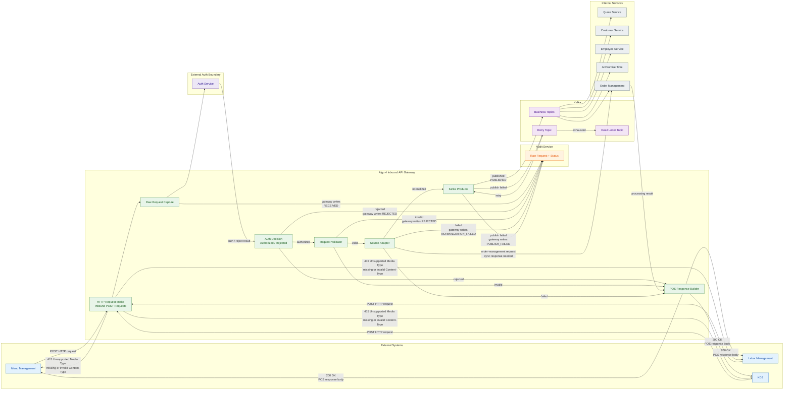
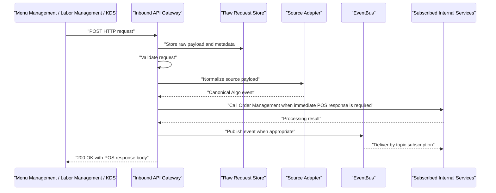

# Algo 4 - Inbound API Gateway HLD

## Purpose

Algo 4 needs an inbound API Gateway that receives external events from Menu Management, Labor Management, and KDS, captures the original request, normalizes the data into a canonical Algo event, and publishes it to the internal EventBus.

The Gateway is responsible for the inbound boundary only. Internal services should subscribe to EventBus topics rather than being called directly by the Gateway.

## Scope

### In Scope

- Receive external `POST` requests.
- Authenticate callers through the Auth Service, with the exact method still TBD.
- Store raw incoming payloads exactly as received.
- Store request metadata for audit, traceability, and debugging.
- Validate incoming requests internally.
- Normalize source-specific payloads through an adapter.
- Produce canonical Algo events.
- Publish events to the internal EventBus.
- Track validation and publishing outcomes.
- Support retry and dead-letter behavior for failed publishing or failed processing.

### Out Of Scope For Now

- Detailed source-specific contract definitions.
- Final Auth Service method.
- Final EventBus technology.
- Final raw storage technology.
- Detailed downstream service implementation.

## Current Design Summary



## Gateway Responsibilities

### 1. Receive External Requests

The Gateway receives `POST` requests from Menu Management, Labor Management, and KDS. These requests trigger internal processing by publishing events into the cluster.

For POS-compatible request flows, the external caller must receive an immediate legacy-compatible response. Algo 3 commonly returns `200 OK` for accepted POS requests and uses the response body to indicate business success or failure. Algo 4 should preserve that contract for POS order-management requests.

### 2. POS-Compatible HTTP Response Contract

For accepted POS HTTP requests, return `200 OK` with a POS response body. The body should include:

- `time`
- `status`
- `rowCount`, when applicable
- `errDescription`, when applicable
- `validationErrors`, when applicable
- `warnings`, when applicable
- `orders`, when applicable

Example success body:

```json
{
  "time": "YYYYMMDD HHMMSS",
  "status": "ok",
  "rowCount": 1,
  "errDescription": "",
  "validationErrors": null,
  "warnings": [],
  "orders": []
}
```

Success should use `status: "ok"` for the normal POS insert flow. Business or processing failures that are still accepted at the HTTP layer should return `200 OK` with a failure status such as `validationError`, `parseError`, `readError`, `dbError`, `internalError`, or `unexpectedError`.

If a JSON endpoint is called without the required `Content-Type: application/json` header, return `415 Unsupported Media Type` with a POS response body using `status: "Failure"` and an `errDescription` such as `Missing body Content-Type:application/json`.

### 3. Auth Service

The Auth Service contract is still missing and should remain an explicit design gap.

Possible options:

- API key.
- HMAC request signature.
- OAuth client credentials.
- mTLS.
- IP allowlist combined with one of the above.

The chosen Auth Service method should identify the source system and allow the Gateway to attach that identity to request metadata.

### 4. Raw Request Storage

The Gateway must store the incoming payload exactly as received, without transformation.

Raw storage should include:

- Raw request body.
- Source system.
- Request headers.
- Request path.
- HTTP method.
- Received timestamp.
- Caller identity, when known.
- Client IP, if allowed by privacy/security rules.
- Correlation ID.
- Validation status.
- Publish status.
- Raw request storage ID or object key.

The raw payload should be treated as immutable audit data.

### 5. Validation

The Gateway validates requests internally. Validation failures should be recorded, but should not leak detailed internal errors to the caller.

Validation can include:

- Required headers.
- Required payload fields.
- Source-specific schema checks.
- Payload size limits.
- Event type support.
- Store or tenant routing context.
- Duplicate detection inputs.

Invalid requests should still be saved as raw data and marked as `REJECTED` in audit. They should not be published to Kafka unless a concrete rejected-request consumer is introduced later.

### 6. Source Adapter

The Gateway contains an internal adapter layer that converts payload formats from Menu Management, Labor Management, and KDS into a canonical Algo event.

Each source can have its own adapter, but all adapters should produce the same envelope shape. This keeps downstream services decoupled from source-specific payload formats.

### 7. Event Publishing

After normalization, the Gateway publishes the canonical Algo event to the EventBus.

The Gateway should publish business events. It should not directly call every downstream service.

Order Management is the exception for POS order-management request flows that need an immediate POS-compatible response. For those requests, the Gateway should synchronously call Order Management, map the result into the POS response body, and still publish relevant business events to Kafka when appropriate.

The Gateway should not subscribe to Kafka and hold the POS HTTP connection open while waiting for an event response from another service. Kafka remains the asynchronous fan-out mechanism after the synchronous POS response path.

Downstream services subscribe to the topics they care about:

- Quote Service.
- Customer Service.
- Employee Service.
- AI Promise Time.
- Order Management.

## Validation Outcome Model

Each inbound request should be tracked through clear internal statuses.

| Status | Meaning |
| --- | --- |
| `RECEIVED` | Gateway accepted the HTTP request. |
| `RAW_STORED` | Raw payload and metadata were persisted. |
| `VALIDATED` | Request passed validation. |
| `REJECTED` | Request failed validation but was recorded. |
| `NORMALIZED` | Adapter created a canonical Algo event. |
| `PUBLISHED` | Event was sent to EventBus. |
| `PUBLISH_FAILED` | EventBus publish failed and retry is required. |
| `DEAD_LETTERED` | Retries were exhausted or the event cannot be processed. |

## Canonical Algo Event

The existing Algo codebase uses JSON-based message payloads and RabbitMQ-style routing conventions. Examples include aggregator messages, cloud order events, cabinet events, and queue suffixes such as `quote`, `eta`, `cloud-orders`, and `cabinet`.

Algo 4 should follow a JSON-first envelope unless another platform decision requires a different format.

### Proposed Event Envelope

```json
{
  "eventId": "uuid",
  "correlationId": "uuid-or-source-correlation-id",
  "eventType": "algo.menu.updated",
  "schemaVersion": "v1",
  "sourceSystem": "menu-management",
  "sourceEventId": "external-id-if-provided",
  "brandId": "brand-or-tenant",
  "country": "country-code",
  "storeId": "external-store-id",
  "receivedAt": "RFC3339 timestamp",
  "occurredAt": "RFC3339 timestamp if provided by source",
  "rawRequestRef": "raw-store-key-or-id",
  "validationStatus": "VALIDATED",
  "data": {}
}
```

### Required Fields

- `eventId`: unique ID generated by Algo 4.
- `correlationId`: ID used for tracing the request across services.
- `eventType`: business event name.
- `schemaVersion`: version of the envelope schema.
- `sourceSystem`: source external system, such as Menu Management, Labor Management, or KDS.
- `receivedAt`: timestamp when Gateway received the request.
- `rawRequestRef`: reference to immutable raw payload storage.
- `data`: normalized event payload.

### Recommended Fields

- `sourceEventId`: external event ID when provided by the source.
- `brandId`: brand or tenant routing context.
- `country`: country routing context.
- `storeId`: external store ID.
- `occurredAt`: timestamp from the source event when available.
- `validationStatus`: latest validation outcome.

## Event Topics

Prefer business-event topics over service-target topics.

Candidate logical topics:

- `algo.inbound.received`
- `algo.menu.updated`
- `algo.labor.updated`
- `algo.kds.order_status.updated`
- `algo.quote.requested`
- `algo.promise_time.requested`

If the final EventBus uses RabbitMQ-style routing, these logical topics can be mapped to routing keys that include brand, country, store, and version context.

Example routing context from the existing Algo system:

```text
{brand}-{country}-{externalStoreId}-v2
{brand}-{country}-{externalStoreId}-eta-v2
{brand}-{country}-{externalStoreId}-quote
{brand}-{country}-{externalStoreId}-cloud-orders
```

## Request Flow



## Failure Handling

### Validation Failure

If validation fails:

- Store raw payload and metadata.
- Mark status as `REJECTED`.
- Do not expose detailed validation errors to the caller.
- Return `200 OK` with a POS response body that carries the failure `status`, unless the failure is at the HTTP/header layer.
- Stop processing without publishing to Kafka.

### Header Failure

If a JSON endpoint is called without `Content-Type: application/json`:

- Store whatever metadata is available when possible.
- Return `415 Unsupported Media Type`.
- Use a POS response body with `status: "Failure"` and an `errDescription` such as `Missing body Content-Type:application/json`.

### Normalization Failure

If adapter normalization fails:

- Keep raw payload.
- Mark status as failed normalization.
- Publish or store a failed-normalization record.
- Include enough metadata for replay after adapter fixes.

### EventBus Publish Failure

If publishing fails:

- Mark status as `PUBLISH_FAILED`.
- Retry according to configured retry policy.
- Move to DLQ after retry exhaustion.
- Preserve the raw request reference and canonical event attempt.

### Downstream Failure

Downstream service failures should be handled by each subscriber using retries and DLQs. The Gateway should not be responsible for direct downstream recovery after the event has been published.

## Idempotency

External systems may retry requests. The Gateway needs an idempotency strategy to avoid duplicate business processing.

Possible idempotency keys:

- `sourceEventId` from the source system.
- Explicit `Idempotency-Key` header.
- Source system + store ID + event type + source event ID.
- Hash of selected stable raw request fields if no source ID exists.

The deduplication decision should happen before publishing the canonical event.

## Observability

The Gateway should emit structured logs, metrics, and traces using `eventId` and `correlationId`.

Recommended metrics:

- Requests received.
- Requests by source system.
- Raw store success/failure.
- Validation success/failure.
- Normalization success/failure.
- Publish success/failure.
- Retry count.
- DLQ count.
- End-to-end latency from request received to event published.

Recommended log fields:

- `eventId`
- `correlationId`
- `sourceSystem`
- `eventType`
- `storeId`
- `validationStatus`
- `publishStatus`
- `rawRequestRef`

## Security And Privacy

Security details are intentionally low detail for now, except for the explicit Auth Service gap.

Minimum design considerations:

- Auth Service method must be selected before production.
- Payload size limits should be enforced.
- Rate limits should be configured per source system.
- Raw payload storage may contain PII and should have retention, access control, and encryption rules.
- Logs should avoid dumping full raw payloads.
- Secrets or auth tokens from headers should not be stored in plain text.

## Open Decisions

| Decision | Current Status |
| --- | --- |
| Auth Service method | Missing / TBD |
| POS HTTP response contract | Return `200 OK` with POS response body for accepted POS requests; return `415 Unsupported Media Type` for missing or invalid JSON `Content-Type` |
| Raw storage technology | TBD |
| EventBus technology | TBD |
| Topic naming standard | Proposed but not final |
| Invalid request behavior | Audit-only |
| Retention policy for raw data | TBD |
| Idempotency key source | TBD |

## Recommended Next Steps

1. Choose the Auth Service method for external systems.
2. Choose raw request storage and retention policy.
3. Finalize the canonical event envelope.
4. Finalize the first set of business event types.
5. Define retry and DLQ policy.
6. Define the first source adapter contract.
7. Create one sequence diagram per critical business flow.

## Notes From Existing Algo Code

The current Algo repository suggests these conventions:

- Messaging is JSON-based.
- RabbitMQ routing keys include brand, country, external store ID, and version context.
- Existing message bodies are source-specific, with no single universal body.
- Existing queue suffixes include `quote`, `eta`, `cloud-orders`, `cabinet`, `courier-location`, and `vehicles-updates`.
- A stable envelope with variable `data` payload is a good fit for Algo 4 because it preserves source flexibility while giving internal services consistent metadata.
