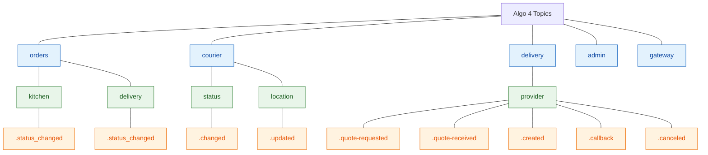
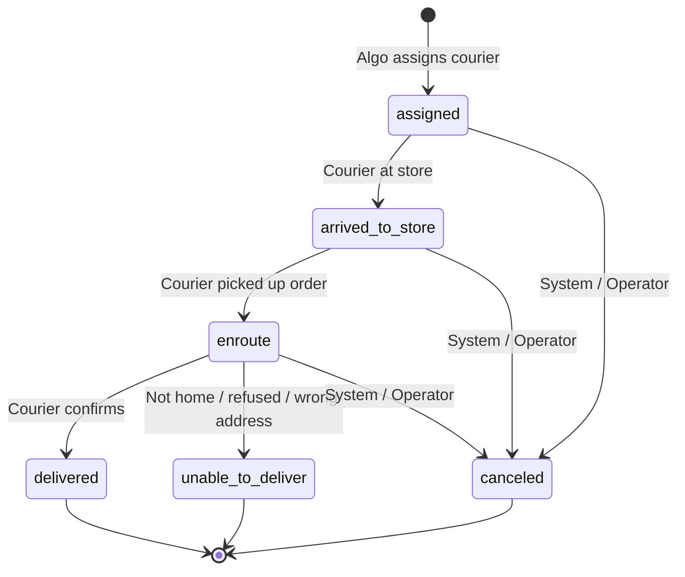

# Algo 4 - Event Taxonomy

<!--
Defines the canonical Kafka topic naming convention and event catalog for
Algo 4. Covers events that flow between internal services, the Cloud Gateway,
and external systems (DragonDrive mobile, DaaS Gateway, Admin Panel).

This document describes the NEW semantics — it is not a 1:1 mapping of Algo 3
statuses or RabbitMQ queues.
-->

**Owner team:** Algo 4 Platform
**Status:** Draft
**Last updated:** 2026-05-20

---

## 1. Purpose

Algo 4 replaces the monolith with independent services communicating over Kafka. This document defines:

- The topic naming convention.
- The event catalog grouped by domain and lifecycle phase.
- Which services publish and consume each event.
- How the Cloud Gateway routes events to and from external systems.
- The payload format (PsEvent).

---

## Visual Overview

### Topic Hierarchy



### Order Delivery State Machine

The specific status is carried in the payload (`value.status`). All transitions flow through a single topic `orders.delivery.status_changed`.



---

## 2. Topic Naming Convention

### Structure

```
{domain}.{lifecycle}.{event-name}
```

- **Domain:** The business aggregate (`orders`, `courier`, `delivery`, `admin`).
- **Lifecycle:** The phase or sub-domain within that aggregate (`kitchen`, `delivery`, `location`, `status`).
- **Event name:** What happened (`status_changed`, `updated`, `callback`).

### Separator

Dot (`.`) — enables clean wildcard subscription boundaries.

### Wildcard Subscription Examples

| Pattern | What it captures |
|---|---|
| `orders.*` | All order events (kitchen + delivery) |
| `orders.kitchen.*` | Kitchen lifecycle only |
| `orders.delivery.*` | Delivery lifecycle only |
| `courier.*` | All courier-domain events |
| `delivery.provider.*` | All 3PL provider events |

### Naming Rules

- Dot-separated hierarchy, lowercase, kebab-case within levels.
- No direction suffix (`-in` / `-out`). Direction is carried in the event envelope (`sourceSystem` field).
- No version suffix in the topic name. Schema versioning lives in the envelope (`schemaVersion` field).

---

## 3. Ordering Guarantee Model

Events within the same lifecycle topic are ordered by Kafka partition. Since all status changes for a given entity flow through a single topic, ordering is guaranteed by partition key.

**Partition keys:**
- `orders.delivery.status_changed` → partitioned by `orderId`
- `orders.kitchen.status_changed` → partitioned by `orderId`
- `courier.status.changed` → partitioned by `courierId`
- `courier.location.updated` → partitioned by `courierId`

A consumer processing events for a given order (or courier) will always see them in the order they were published.

---

## 4. Payload Format

Events use the existing `PsEvent` format:

```json
{
  "eventName": "Order",
  "value": { "status": "enroute", ... },
  "storeNo": "12345",
  "carrierId": "c-001",
  "market": "UK",
  "eventInLocalTime": "2026-05-20T12:00:00"
}
```

The `eventName` and `value.status` fields carry the specific business fact. The Kafka topic provides the domain/lifecycle grouping; the payload provides the detail.

This means:
- No new canonical envelope in Phase 1 — services produce and consume PsEvent as they do today.
- Mobile app (DragonDrive) receives the same wire format over WebSocket via Proxy with no translation needed.
- Proxy forwards PsEvents between Kafka and WebSocket without transformation.

---

## 5. Events

| Event | Payload | Source → Destination |
|---|---|---|
| **OrderKitchenStatusChanged** | `{ status: new / on-shelf / in-oven / packing / ready }` | Algo → Algo (internal, not routed to mobile) |
| **OrderDeliveryStatusChanged** | `{ status: assigned / arrived-to-store / enroute / delivered / unable-to-deliver / canceled }` | Algo → Mobile (for `assigned`, `canceled`); Mobile → Algo (for the rest) |
| **CourierStatusChanged** | `{ status: logged-in / logged-out / in-store / out-of-store / panic }` | Mobile → Algo |
| **CourierLocationUpdated** | `{ lat, lng, accuracy, source, secondsPassed }` | Mobile → Algo/Tracker |
| **DaasQuoteStatusChanged** | `{ status: requested / received / failed, quoteData }` | Algo → DaaS (`requested`); DaaS → Algo (`received`, `failed`) |
| **DaasDeliveryStatusChanged** | `{ status: created / create-failed / canceled / eta-updated, aggOrderId }` | Algo → DaaS (`created`, `canceled`); DaaS → Algo (`create-failed`, `eta-updated`) |
| **DaasProviderCallback** | `{ aggregatorId, aggOrderId, deliveryStatus, courierStatus, courier, pickupETA }` | DaaS → Algo (via Cloud Gateway) |
| **DaasDiscoveryReceived** | `{ providerId, providerConf }` | DaaS → Algo (via Cloud Gateway) |
| **MobileReply** | `{ targetDeviceId, inReplyTo, value }` | Algo → Mobile (via Cloud Gateway → Proxy) |
| **MobilePush** | `{ targetDeviceId, value }` | Algo → Mobile (via Cloud Gateway → Proxy) |
| **AdminActionPerformed** | `{ action: polygon-updated / store-updated / provider-updated / replay-requested, data }` | Admin Panel → Algo (via Cloud Gateway) |

---

## 6. Event Catalog (Detailed)

### Orders — Kitchen Lifecycle

Kitchen lifecycle events track an order through the preparation pipeline. Published by the KDS / Ticket Service. Consumed by Admin Panel, makeline UI, tracking projection. **Not routed to mobile couriers** through the Cloud Gateway.

| Topic | Published by | Description |
|---|---|---|
| `orders.kitchen.status_changed` | KDS / Ticket Service | Order kitchen status changed |

**Partition key:** `orderId`

**Statuses carried in payload:**
- `new` — order entered the kitchen queue
- `on-shelf` — order placed on prep shelf
- `in-oven` — order entered oven / cook station
- `packing` — order being packed
- `ready` — order ready for courier pickup

**Handoff point:** `status: ready` is the signal that Dispatch / Order Management uses to trigger courier assignment.

**Consumers:**
- Ticket Service / Order Sequencer (state machine progression).
- Admin Panel (dashboard visibility).
- Tracking projection (customer-facing "your order is being prepared").
- Dispatch (listens for `ready` to begin assignment).

---

### Orders — Delivery Lifecycle

Delivery lifecycle events track an order from courier assignment through final outcome. The Cloud Gateway subscribes to `orders.delivery.*` and routes relevant events to DragonDrive through Proxy.

| Topic | Published by | Description |
|---|---|---|
| `orders.delivery.status_changed` | Order Management | Order delivery status changed |

**Partition key:** `orderId`

**Statuses carried in payload:**

| Status | Triggered by | Description |
|---|---|---|
| `assigned` | Algo decision | Courier assigned to order |
| `arrived-to-store` | Mobile (courier) | Courier arrived at store for pickup |
| `enroute` | Mobile (courier) | Courier left store with order |
| `delivered` | Mobile (courier) | Courier confirmed delivery |
| `unable-to-deliver` | Mobile (courier) | Courier reports delivery failure |
| `canceled` | System / Operator | Order canceled before or during delivery |

**Direction through Cloud Gateway:**

| Status | Direction | Flow |
|---|---|---|
| `assigned` | Algo → mobile | Order Management → Kafka → Cloud Gateway → Proxy → DragonDrive |
| `arrived-to-store` | Mobile → Algo | DragonDrive → Proxy → Cloud Gateway → Kafka → Order Management |
| `enroute` | Mobile → Algo | DragonDrive → Proxy → Cloud Gateway → Kafka → Order Management |
| `delivered` | Mobile → Algo | DragonDrive → Proxy → Cloud Gateway → Kafka → Order Management |
| `unable-to-deliver` | Mobile → Algo | DragonDrive → Proxy → Cloud Gateway → Kafka → Order Management |
| `canceled` | Algo → mobile | Order Management → Kafka → Cloud Gateway → Proxy → DragonDrive |

**Payload — `unable-to-deliver`:** Carries a `reason` field (e.g. `customer-not-home`, `wrong-address`, `refused`, `other`).

**Payload — `canceled`:** Carries a `reason` field (e.g. `dispatch-canceled`, `customer-canceled`, `operator-canceled`, `refund`).

**Consumers:**
- Cloud Gateway (routes to/from mobile).
- AI Promise Time (delivery timing signals).
- Customer Service (notifications, tracking).
- Admin Panel (visibility).
- Delivery Management (3PL coordination when applicable).

---

### Courier Domain

Courier-domain events represent courier state independent of any specific order. Published by Courier (Vehicle) Service or triggered by mobile. The Cloud Gateway routes relevant events to/from DragonDrive through Proxy.

| Topic | Published by | Description |
|---|---|---|
| `courier.status.changed` | Courier Service | Courier status changed |
| `courier.location.updated` | Courier Service | GPS ping |

**Partition key:** `courierId`

**Statuses carried in `courier.status.changed` payload:**

| Status | Triggered by | Description |
|---|---|---|
| `logged-in` | Mobile (courier) | Courier started a shift / session |
| `logged-out` | Mobile (courier) | Courier ended shift |
| `in-store` | Mobile (geofence) | Courier entered store geofence |
| `out-of-store` | Mobile (geofence) | Courier left store geofence |
| `panic` | Mobile (courier) | Emergency signal |

**Direction through Cloud Gateway:**

All courier events originate from mobile → Algo (the courier's device is the source of truth for their status and location). Algo does not push courier-status events back to the device that sent them.

Exceptions:
- `logged-in` — after Algo processes the login, it pushes a **reply** with session config (startup options, mobile parameters). This reply is a separate event (see "Cloud Gateway — Device Replies" below).

**Consumers:**
- Order Management / Dispatch (courier availability for assignment).
- AI Promise Time (courier position for ETA).
- Telematics projection (location history, geofence analytics).
- Admin Panel (fleet visibility).
- Delivery Management (courier capacity).

**Notes on `courier.location.updated`:** High-volume stream. Separate topic from courier status to allow independent scaling, retention, and partition count. Short TTL (seconds to low minutes) — stale location data has no business value.

---

### Delivery Domain (3PL / DaaS)

Delivery-domain events represent the interaction between Algo and third-party logistics providers through the DaaS Gateway. The Cloud Gateway owns this boundary.

| Topic | Published by | Description |
|---|---|---|
| `delivery.provider.quote-requested` | Dispatch / Quote Service | Request quote from 3PL |
| `delivery.provider.quote-received` | Cloud Gateway | DaaS responded with quote |
| `delivery.provider.quote-failed` | Cloud Gateway | No successful quote from any provider |
| `delivery.provider.created` | Cloud Gateway | 3PL delivery created |
| `delivery.provider.create-failed` | Cloud Gateway | 3PL rejected delivery creation |
| `delivery.provider.callback` | Cloud Gateway | Provider status update (assigned, picked up, nearby, etc.) |
| `delivery.provider.eta-updated` | Cloud Gateway | Provider pushed ETA update |
| `delivery.provider.canceled` | Cloud Gateway | 3PL delivery canceled |
| `delivery.provider.discovery-received` | Cloud Gateway | Provider config refreshed |

**Partition key:** `storeId` (all provider events for a store are ordered together).

**Direction:** All `delivery.provider.*` events either originate from the Cloud Gateway (translating DaaS responses/callbacks into canonical events) or are consumed by the Cloud Gateway (translating internal requests into DaaS HTTP calls).

| Event | Cloud Gateway role |
|---|---|
| `quote-requested` | Consumes → calls `POST /api/v2/deliveries/quotes` on DaaS |
| `quote-received` | Publishes ← DaaS response |
| `created` | Publishes ← DaaS acknowledged `POST /api/v2/deliveries` |
| `callback` | Publishes ← DaaS provider callback |
| `canceled` | Publishes ← DaaS acknowledged `DELETE /api/v2/deliveries` |

**Consumers:**
- Dispatch (quote results, provider assignment decisions).
- Order Management (provider status feeds into order lifecycle).
- AI Promise Time (provider ETAs).
- Admin Panel (visibility, audit).

---

### Cloud Gateway — Device Replies

When the Cloud Gateway routes a mobile-originated event to Algo and a reply needs to reach the device, the reply is a separate event on a dedicated topic.

| Topic | Published by | Description |
|---|---|---|
| `gateway.mobile.reply` | Cloud Gateway | Response payload destined for a specific device |

**Partition key:** `(storeId, courierId)`

**Payload:** PsEvent with `targetDeviceId`, `inReplyTo` (correlationId of the original mobile event), and the response body in `value`.

**Examples:**
- After `courier.status.changed` with `logged-in` is processed, Order Management publishes session config; Cloud Gateway wraps it as a `gateway.mobile.reply` with startup options, mobile parameters, and available orders.
- After `orders.delivery.status_changed` with `arrived-to-store` is processed, if there's an item list to send back, it flows as a `gateway.mobile.reply`.

**Notes:** Proxy consumes from this topic and routes to the device connection over WebSocket.

---

### Cloud Gateway — Device Push (Algo-initiated)

Events that Algo pushes to mobile devices without a prior mobile request.

| Topic | Published by | Description |
|---|---|---|
| `gateway.mobile.push` | Cloud Gateway | Algo-initiated push to a device |

**Partition key:** `(storeId, courierId)`

**Examples of data carried:**
- `orders.delivery.status_changed` with `assigned` translated into a device-ready PsEvent.
- `orders.delivery.status_changed` with `canceled` notification.
- Clear-data command (shift reset).
- Push notification content.
- Available-orders list refresh.
- Bid request (offer a delivery to a courier).

**Notes:** The Cloud Gateway consumes internal bus events (e.g. `orders.delivery.status_changed`) and produces onto `gateway.mobile.push` with the device-targeted PsEvent. Proxy consumes this topic and delivers over WebSocket.

---

### Admin Domain

Admin-domain events represent operator actions from the Admin Panel UI. The Cloud Gateway serves the REST surface and translates writes into canonical events.

| Topic | Published by | Description |
|---|---|---|
| `admin.action.polygon-updated` | Cloud Gateway | Operator updated delivery polygons |
| `admin.action.store-updated` | Cloud Gateway | Operator changed store config |
| `admin.action.provider-updated` | Cloud Gateway | Operator changed DaaS provider settings |
| `admin.action.replay-requested` | Cloud Gateway | Operator triggered event replay |

**Partition key:** `storeId`

**Direction:** Admin Panel → Cloud Gateway (HTTPS REST) → Kafka → consuming services.

**Consumers:** Varies per action — Dispatch (polygons, provider config), Store Service (store settings), Cloud Gateway itself (replay).

---

## 7. Cloud Gateway Subscription Summary

| Cloud Gateway subscribes to | Action |
|---|---|
| `orders.delivery.status_changed` | Routes to DragonDrive via Proxy (for `assigned`, `canceled`) |
| `delivery.provider.quote-requested` | Calls DaaS Gateway HTTP |
| `delivery.provider.*` (internal commands) | Translates to DaaS HTTP calls |
| DaaS callback surface (external) | Publishes `delivery.provider.callback` / `quote-received` / etc. |
| Proxy event surface (external) | Publishes `orders.delivery.status_changed` / `courier.*` from mobile |

| Cloud Gateway publishes to | Source |
|---|---|
| `delivery.provider.callback` | DaaS callbacks |
| `delivery.provider.quote-received` | DaaS responses |
| `orders.delivery.status_changed` | Mobile via Proxy (enroute, delivered, etc.) |
| `courier.status.changed` | Mobile via Proxy |
| `courier.location.updated` | Mobile via Proxy |
| `gateway.mobile.reply` | Internal services responding to mobile events |
| `gateway.mobile.push` | Internal services pushing to devices |
| `admin.action.*` | Admin Panel UI REST writes |

---

## 8. Open Questions

| Question | Current Status |
|---|---|
| Proxy ↔ Cloud Gateway transport | HTTP or cloud message queue; TBD |
| DaaS Gateway ↔ Cloud Gateway transport | HTTP or cloud message queue; TBD |
| `courier.location.updated` partition count | Needs capacity modeling; high-volume stream needs more partitions than status events |
| `orders.kitchen.status_changed` → Dispatch handoff | Confirm Dispatch subscribes directly or Order Management mediates |
| Cancellation sub-reasons taxonomy | Need product input on the `reason` enum for `canceled` and `unable-to-deliver` |
| `StartUpOptions` / `AppData` / `Geofence` events | Where do these land in the topic structure? Likely `courier.device.*` or folded into `courier.status.changed` |
| BidRequest / AvailableOrders push semantics | Command-style events; confirm they go on `gateway.mobile.push` |
| Topic-level retention and TTL per event family | Needs ops input (location: hours; status: days; audit: weeks) |
| Shared/Pooling Drivers integration | Visible in architecture diagram; no event contract defined yet |
| PsEvent envelope evolution | Phase 1 uses PsEvent as-is; when/if a new canonical envelope is introduced TBD |
