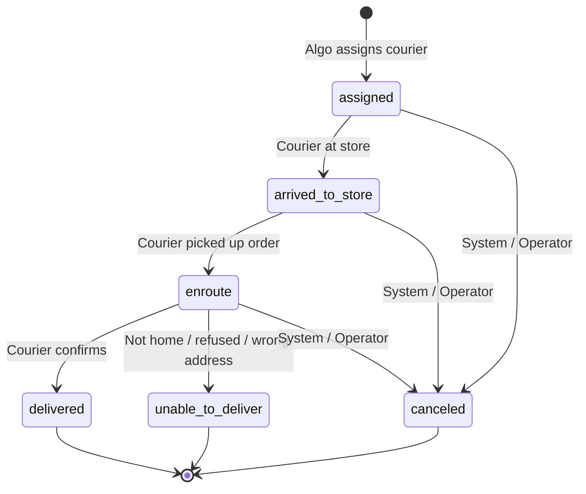

# Algo 4 - Event Taxonomy

<!--
Defines the canonical EventBus topic naming convention and event catalog for
Algo 4. Covers events that flow between internal services, the Cloud Gateway,
and external systems (DragonDrive mobile, DaaS Gateway, Admin Panel).

This document describes the NEW semantics — it is not a 1:1 mapping of Algo 3
statuses or RabbitMQ queues.
-->

**Owner team:** Algo 4 Platform
**Status:** Draft
**Last updated:** 2026-05-20

---

## 1. Purpose

Algo 4 replaces the monolith with independent services communicating over EventBus. This document defines:

- The topic naming convention.
- The event catalog grouped by domain and lifecycle phase.
- Which services publish and consume each event.
- How the Cloud Gateway routes events to and from external systems.
- The payload format (PsEvent).

---

## Visual Overview

### Topic Hierarchy

```mermaid
graph TD
  root["Algo 4 Topics"]

  orders["orders"]
  courier["courier"]
  delivery["delivery"]
  customer["customer"]
  store["store"]
  admin["admin"]

  intake["intake"]
  kitchen["kitchen"]
  ordersDel["delivery"]
  payment["payment"]
  courierStatus["status"]
  courierLoc["location"]
  courierProfile["profile"]
  courierSession["session"]
  courierVehicle["vehicle"]
  provider["provider"]
  custVip["vip"]
  storeClean["cleanliness"]
  adminAction["action"]
  adminNotif["notification"]
  adminPerm["permission_group"]

  root --- orders
  root --- courier
  root --- delivery
  root --- customer
  root --- store
  root --- admin

  orders --- intake
  orders --- kitchen
  orders --- ordersDel
  orders --- payment

  courier --- courierStatus
  courier --- courierLoc
  courier --- courierProfile
  courier --- courierSession
  courier --- courierVehicle

  delivery --- provider
  customer --- custVip
  store --- storeClean

  admin --- adminAction
  admin --- adminNotif
  admin --- adminPerm

  intake --- i1[".received"]
  kitchen --- k1[".status_changed"]
  ordersDel --- d1[".status_changed / .bid_offered"]
  payment --- pay1[".updated"]
  courierStatus --- cs1[".changed"]
  courierLoc --- cl1[".updated"]
  courierProfile --- cp1[".upserted"]
  courierSession --- cse1[".configured / .cleared"]
  courierVehicle --- cv1[".assigned"]
  provider --- p1[".quote_requested / .quote_received / .created / .callback / .canceled"]
  custVip --- v1[".linked / .unlinked"]
  storeClean --- sc1[".observed"]
  adminAction --- a1[".polygon_updated / .store_updated / .provider_updated / .replay_requested"]
  adminNotif --- an1[".posted"]
  adminPerm --- ap1[".upserted"]

  classDef domain fill:#E3F2FD,stroke:#1565C0,color:#0D47A1
  classDef lifecycle fill:#E8F5E9,stroke:#2E7D32,color:#1B5E20
  classDef event fill:#FFF3E0,stroke:#EF6C00,color:#E65100

  class orders,courier,delivery,customer,store,admin domain
  class intake,kitchen,ordersDel,payment,courierStatus,courierLoc,courierProfile,courierSession,courierVehicle,provider,custVip,storeClean,adminAction,adminNotif,adminPerm lifecycle
  class i1,k1,d1,pay1,cs1,cl1,cp1,cse1,cv1,p1,v1,sc1,a1,an1,ap1 event
```



### Order Delivery State Machine

The specific status is carried in the payload (`value.status`). All transitions flow through a single topic `orders.delivery.status_changed`.



---

## 2. Topic Naming Convention

### Structure

```
{domain}.{lifecycle}.{event-name}
```

- **Domain:** The business entity (`orders`, `courier`, `delivery`, `customer`, `store`, `admin`).
- **Lifecycle:** The phase or sub-domain within that entity (`intake`, `kitchen`, `delivery`, `payment`, `status`, `location`, `profile`, `session`, `vehicle`, `provider`, `vip`, `cleanliness`, `action`, `notification`, `permission_group`).
- **Event name:** What happened, past-tense fact (`received`, `status_changed`, `updated`, `assigned`, `posted`, `linked`, `observed`).

### Separator

Dot (`.`) — enables clean wildcard subscription boundaries.

### Wildcard Subscription Examples

| Pattern | What it captures |
|---|---|
| `orders.*` | All order events (intake + kitchen + delivery + payment) |
| `orders.kitchen.*` | Kitchen lifecycle only |
| `orders.delivery.*` | Delivery lifecycle only (assignment, bids, status) |
| `courier.*` | All courier-domain events |
| `delivery.provider.*` | All 3PL provider events |
| `customer.*` | All customer-domain events |
| `store.*` | All store-environment events |
| `admin.*` | All operator / admin events |

### Naming Rules

- Dot-separated hierarchy, lowercase. **`snake_case` within each level** (e.g. `status_changed`, `bid_offered`, `permission_group`, `available_orders`).
- Past-tense facts only — `received`, `assigned`, `status_changed`, `posted`. Never imperatives (`assign_courier`, `cancel_order`).
- No direction suffix (`-in` / `-out`). Direction is carried in the event envelope (`sourceSystem` field).
- No transport prefix (`gateway.mobile.*`, `kafka.*`). Routing belongs in code, not the topic name.
- No source-system prefix (`pos.*`, `kds.*`, `vip.*`). The source is carried in the envelope.
- No version suffix in the topic name. Schema versioning lives in the envelope (`schemaVersion` field).

---

## 3. Ordering Guarantee Model

Events within the same lifecycle topic are ordered by EventBus partition. Since all status changes for a given entity flow through a single topic, ordering is guaranteed by partition key.

**Partition keys:**
- `orders.intake.received` → partitioned by `orderId`
- `orders.kitchen.*` → partitioned by `orderId`
- `orders.delivery.*` → partitioned by `orderId`
- `orders.payment.updated` → partitioned by `orderId`
- `courier.status_changed` / `courier.location.updated` / `courier.profile.upserted` / `courier.schedule.upserted` / `courier.session.*` / `courier.vehicle.assigned` → partitioned by `courierId`
- `customer.vip.linked` / `customer.vip.unlinked` → partitioned by `customerId` (or `vipKey`)
- `store.cleanliness.observed` → partitioned by `storeId`
- `delivery.provider.*` → partitioned by `storeId`
- `admin.*` → partitioned by `storeId`

A consumer processing events for a given order (or courier) will always see them in the order they were published.

---

## 4. Payload Format

Events use the existing `PsEvent` format:

```json
{
  "eventName": "Order",
  "value": { "status": "enroute", ... },
  "storeNo": "12345",
  "carrierId": "c-001",
  "market": "UK",
  "eventInLocalTime": "2026-05-20T12:00:00"
}
```

The `eventName` and `value.status` fields carry the specific business fact. The EventBus topic provides the domain/lifecycle grouping; the payload provides the detail.

This means:
- No new canonical envelope in Phase 1 — services produce and consume PsEvent as they do today.
- Mobile app (DragonDrive) receives the same wire format over WebSocket via Proxy with no translation needed.
- Proxy forwards PsEvents between EventBus and WebSocket without transformation.

---

## 5. Events

All status values inside payloads use `snake_case` to match topic-name segments.

| Event topic | Payload | Source → Destination |
|---|---|---|
| `orders.intake.received` | full inbound order envelope (raw + OM commit + promise time on POS-sync path) | Inbound API Gateway → Algo |
| `orders.kitchen.status_changed` | `{ status: new / on_shelf / in_oven / packing / ready }` | Algo → Algo (internal, not routed to mobile) |
| `orders.delivery.status_changed` | `{ status: assigned / arrived_to_store / enroute / delivered / unable_to_deliver / canceled }` | Algo → Mobile (for `assigned`, `canceled`); Mobile → Algo (for the rest) |
| `orders.delivery.bid_offered` | `{ orderId, courierId, expiresAt, … }` | Algo → Mobile (Cloud Gateway delivers to courier device) |
| `orders.payment.updated` | `{ paymentId, status, amount, … }` | Brand POS → Algo |
| `courier.status.changed` | `{ status: logged_in / logged_out / in_store / out_of_store / panic }` | Mobile → Algo |
| `courier.location.updated` | `{ lat, lng, accuracy, source, secondsPassed }` | Mobile → Algo/Tracker |
| `courier.profile.upserted` | `{ courierId, name, role, … }` | Brand POS → Algo (Labor Management feed) |
| `courier.schedule.upserted` | `{ courierId, day, shifts: […] }` | Brand POS → Algo (Labor Management feed) |
| `courier.session.configured` | `{ startupOptions, mobileParams, … }` | Algo → Mobile (in response to `logged_in`) |
| `courier.session.cleared` | `{ courierId, reason }` | Algo → Mobile |
| `courier.available_orders.updated` | `{ courierId, orders: […] }` | Algo → Mobile |
| `courier.vehicle.assigned` | `{ courierId, vehicleId }` | Brand POS / Fleet ops → Algo |
| `customer.vip.linked` / `customer.vip.unlinked` | `{ customerId, vipKey, attributes }` | Brand VIP / Loyalty → Algo |
| `store.cleanliness.observed` | `{ storeId, sessionId, eventTime, isCleaningEvent, isStainingEvent }` | Cleanliness camera → Algo |
| `delivery.provider.quote_requested` | `{ orderId, providers: […], pickup, dropoff }` | Algo → DaaS |
| `delivery.provider.quote_received` / `quote_failed` | `{ orderId, providerId, quoteData / errorReason }` | DaaS → Algo (via Cloud Gateway) |
| `delivery.provider.created` / `create_failed` | `{ orderId, providerId, aggOrderId, status }` | DaaS → Algo (via Cloud Gateway) |
| `delivery.provider.callback` / `eta_updated` | `{ aggregatorId, aggOrderId, deliveryStatus, courier, pickupETA }` | DaaS → Algo (via Cloud Gateway) |
| `delivery.provider.canceled` | `{ orderId, providerId, aggOrderId, reason }` | DaaS → Algo (via Cloud Gateway) |
| `admin.action.polygon_updated` / `store_updated` / `provider_updated` / `replay_requested` | `{ action, data }` | Admin Panel → Algo (via Cloud Gateway) |
| `admin.notification.posted` | `{ storeId, kdsList, notification, time }` | Brand POS → Algo (operator-posted station notification) |
| `admin.permission_group.upserted` | `{ groupId, permissions: […] }` | Brand POS → Algo (Labor Management feed) |

---

## 6. Event Catalog (Detailed)

### Orders — Kitchen Lifecycle

Kitchen lifecycle events track an order through the preparation pipeline. Published by the KDS / Ticket Service. Consumed by Admin Panel, makeline UI, tracking projection. **Not routed to mobile couriers** through the Cloud Gateway.

| Topic | Published by | Description |
|---|---|---|
| `orders.kitchen.status_changed` | KDS / Ticket Service | Order kitchen status changed |

**Partition key:** `orderId`

**Statuses carried in payload:**
- `new` — order entered the kitchen queue
- `on_shelf` — order placed on prep shelf
- `in_oven` — order entered oven / cook station
- `packing` — order being packed
- `ready` — order ready for courier pickup

**Handoff point:** `status: ready` is the signal that Dispatch / Order Management uses to trigger courier assignment.

**Consumers:**
- Ticket Service / Order Sequencer (state machine progression).
- Admin Panel (dashboard visibility).
- Tracking projection (customer-facing "your order is being prepared").
- Dispatch (listens for `ready` to begin assignment).

---

### Orders — Delivery Lifecycle

Delivery lifecycle events track an order from courier assignment through final outcome. The Cloud Gateway subscribes to `orders.delivery.*` and routes relevant events to DragonDrive through Proxy.

| Topic | Published by | Description |
|---|---|---|
| `orders.delivery.status_changed` | Order Management | Order delivery status changed |

**Partition key:** `orderId`

**Statuses carried in payload:**

| Status | Triggered by | Description |
|---|---|---|
| `assigned` | Algo decision | Courier assigned to order |
| `arrived_to_store` | Mobile (courier) | Courier arrived at store for pickup |
| `enroute` | Mobile (courier) | Courier left store with order |
| `delivered` | Mobile (courier) | Courier confirmed delivery |
| `unable_to_deliver` | Mobile (courier) | Courier reports delivery failure |
| `canceled` | System / Operator | Order canceled before or during delivery |

**Direction through Cloud Gateway:**

| Status | Direction | Flow |
|---|---|---|
| `assigned` | Algo → mobile | Order Management → EventBus → Cloud Gateway → Proxy → DragonDrive |
| `arrived_to_store` | Mobile → Algo | DragonDrive → Proxy → Cloud Gateway → EventBus → Order Management |
| `enroute` | Mobile → Algo | DragonDrive → Proxy → Cloud Gateway → EventBus → Order Management |
| `delivered` | Mobile → Algo | DragonDrive → Proxy → Cloud Gateway → EventBus → Order Management |
| `unable_to_deliver` | Mobile → Algo | DragonDrive → Proxy → Cloud Gateway → EventBus → Order Management |
| `canceled` | Algo → mobile | Order Management → EventBus → Cloud Gateway → Proxy → DragonDrive |

**Payload — `unable_to_deliver`:** Carries a `reason` field (e.g. `customer_not_home`, `wrong_address`, `refused`, `other`).

**Payload — `canceled`:** Carries a `reason` field (e.g. `dispatch_canceled`, `customer_canceled`, `operator_canceled`, `refund`).

**Consumers:**
- Cloud Gateway (routes to/from mobile).
- AI Promise Time (delivery timing signals).
- Customer Service (notifications, tracking).
- Admin Panel (visibility).
- Delivery Management (3PL coordination when applicable).

---

### Courier Domain

Courier-domain events represent courier state independent of any specific order. Published by Courier (Vehicle) Service or triggered by mobile. The Cloud Gateway routes relevant events to/from DragonDrive through Proxy.

| Topic | Published by | Description |
|---|---|---|
| `courier.status.changed` | Courier Service | Courier status changed |
| `courier.location.updated` | Courier Service | GPS ping |
| `courier.profile.upserted` | Inbound API Gateway (from brand POS Labor feed) | Courier roster snapshot/delta |
| `courier.schedule.upserted` | Inbound API Gateway (from brand POS Labor feed) | Per-courier shift schedule |
| `courier.session.configured` | Order Management (in reply to `logged_in`) | Session config / startup options for the device |
| `courier.session.cleared` | Order Management | Clear-data / shift reset signal |
| `courier.available_orders.updated` | Order Management | Courier's offerable-order list changed |
| `courier.vehicle.assigned` | Inbound API Gateway (from brand POS / fleet ops) | Vehicle assigned to courier |

**Partition key:** `courierId`

**Statuses carried in `courier.status.changed` payload:**

| Status | Triggered by | Description |
|---|---|---|
| `logged_in` | Mobile (courier) | Courier started a shift / session |
| `logged_out` | Mobile (courier) | Courier ended shift |
| `in_store` | Mobile (geofence) | Courier entered store geofence |
| `out_of_store` | Mobile (geofence) | Courier left store geofence |
| `panic` | Mobile (courier) | Emergency signal |

**Direction through Cloud Gateway:**

All courier events originate from mobile → Algo (the courier's device is the source of truth for their status and location). Algo does not push courier-status events back to the device that sent them.

Exceptions:
- `logged_in` — after Algo processes the login, Order Management publishes `courier.session.configured` with startup options and mobile parameters. Cloud Gateway subscribes and translates this entity event to the device wire format (PsEvent).

**Consumers:**
- Order Management / Dispatch (courier availability for assignment).
- AI Promise Time (courier position for ETA).
- Telematics projection (location history, geofence analytics).
- Admin Panel (fleet visibility).
- Delivery Management (courier capacity).

**Notes on `courier.location.updated`:** High-volume stream. Separate topic from courier status to allow independent scaling, retention, and partition count. Short TTL (seconds to low minutes) — stale location data has no business value.

---

### Delivery Domain (3PL / DaaS)

Delivery-domain events represent the interaction between Algo and third-party logistics providers through the DaaS Gateway. The Cloud Gateway owns this boundary.

| Topic | Published by | Description |
|---|---|---|
| `delivery.provider.quote_requested` | Dispatch / Quote Service | Request quote from 3PL |
| `delivery.provider.quote_received` | Cloud Gateway | DaaS responded with quote |
| `delivery.provider.quote_failed` | Cloud Gateway | No successful quote from any provider |
| `delivery.provider.created` | Cloud Gateway | 3PL delivery created |
| `delivery.provider.create_failed` | Cloud Gateway | 3PL rejected delivery creation |
| `delivery.provider.callback` | Cloud Gateway | Provider status update (assigned, picked up, nearby, etc.) |
| `delivery.provider.eta_updated` | Cloud Gateway | Provider pushed ETA update |
| `delivery.provider.canceled` | Cloud Gateway | 3PL delivery canceled |

**Partition key:** `storeId` (all provider events for a store are ordered together).

**Direction:** All `delivery.provider.*` events either originate from the Cloud Gateway (translating DaaS responses/callbacks into canonical events) or are consumed by the Cloud Gateway (translating internal requests into DaaS HTTP calls).

| Event | Cloud Gateway role |
|---|---|
| `quote_requested` | Consumes → calls `POST /api/v2/deliveries/quotes` on DaaS |
| `quote_received` | Publishes ← DaaS response |
| `created` | Publishes ← DaaS acknowledged `POST /api/v2/deliveries` |
| `callback` | Publishes ← DaaS provider callback |
| `canceled` | Publishes ← DaaS acknowledged `DELETE /api/v2/deliveries` |

**Consumers:**
- Dispatch (quote results, provider assignment decisions).
- Order Management (provider status feeds into order lifecycle).
- AI Promise Time (provider ETAs).
- Admin Panel (visibility, audit).

---

### Orders — Intake & Payment

| Topic | Published by | Description |
|---|---|---|
| `orders.intake.received` | Inbound API Gateway | A new order entered the cluster (POS sync path or cloud-orders RabbitMQ path) |
| `orders.payment.updated` | Inbound API Gateway (from brand POS) | Payment status for an order changed |

**Partition key:** `orderId`

**Notes:** `orders.intake.received` carries the raw inbound payload plus, on the POS-sync path, the Order Management commit result and the AI Promise Time response.

---

### Orders — Kitchen Lifecycle (extended)

| Topic | Published by | Description |
|---|---|---|
| `orders.kitchen.status_changed` | KDS / Ticket Service | Order kitchen status changed (see Kitchen Lifecycle above) |
| `orders.kitchen.action_recorded` | Inbound API Gateway (from vendor KDS) | KDS per-order action (bump / cook / pack / remake / undo / prioritize) |
| `orders.kitchen.batch_action_recorded` | Inbound API Gateway (from vendor KDS) | KDS multi-order batch action (audit-only — per-order events on `action_recorded` are source of truth) |
| `orders.kitchen.placement_changed` | Inbound API Gateway (from vendor KDS) | Order moved to makeline / shelf slot / different line |
| `orders.kitchen.item_status_changed` | Inbound API Gateway (from vendor KDS) | Per-item status (`waiting` / `on_makeline` / `ready` / `canceled` / `parked`) |
| `orders.kitchen.item_analyzed` | Inbound API Gateway (from pack-station camera) | Vision analysis of a packed item |
| `orders.kitchen.matcher_observed` | Inbound API Gateway (from makeline matcher camera) | Makeline matcher observation for an order |

**Partition key:** `orderId`

---

### Orders — Cabinet Lifecycle

| Topic | Published by | Description |
|---|---|---|
| `orders.cabinet.status_changed` | Inbound API Gateway (from holding-cabinet PUC) | Cabinet status (`loaded` / `collected` / `removed`) for an order |

**Partition key:** `orderId` (or `(storeId, cabinetOrderId)` where the order-system id is not yet linked)

---

### Orders — Delivery Bids

| Topic | Published by | Description |
|---|---|---|
| `orders.delivery.bid_offered` | Order Management | A delivery was offered to a specific courier (Cloud Gateway routes to that courier's device) |

**Partition key:** `orderId`

---

### Customer Domain

| Topic | Published by | Description |
|---|---|---|
| `customer.vip.linked` | Inbound API Gateway (from brand VIP / loyalty) | VIP attributes linked to a customer |
| `customer.vip.unlinked` | Inbound API Gateway (from brand VIP / loyalty) | VIP attributes removed |

**Partition key:** `customerId` (or `vipKey` as a fallback when no customer record yet)

---

### Store Domain

Store-environment facts not tied to a specific order or courier.

| Topic | Published by | Description |
|---|---|---|
| `store.cleanliness.observed` | Inbound API Gateway (from bench / table cleanliness camera) | Cleaning / staining event in the kitchen environment |

**Partition key:** `storeId`

---

### Admin Domain (extended)

| Topic | Published by | Description |
|---|---|---|
| `admin.action.polygon_updated` | Cloud Gateway | Operator updated delivery polygons |
| `admin.action.store_updated` | Cloud Gateway | Operator changed store config |
| `admin.action.provider_updated` | Cloud Gateway | Operator changed DaaS provider settings |
| `admin.action.replay_requested` | Cloud Gateway | Operator triggered event replay |
| `admin.notification.posted` | Inbound API Gateway (from brand POS) | Operator-posted notification destined for KDS stations |
| `admin.permission_group.upserted` | Inbound API Gateway (from brand POS Labor feed) | Permission-group definition snapshot/delta |

**Partition key:** `storeId`

---

### Device routing (no topic)

Earlier drafts proposed `gateway.mobile.push` / `gateway.mobile.reply` for device-bound messages. **We dropped that family.** The Cloud Gateway subscribes to entity topics (`orders.delivery.status_changed`, `orders.delivery.bid_offered`, `courier.session.configured`, `courier.session.cleared`, `courier.available_orders.updated`, etc.), translates each event to the device wire format (PsEvent), and delivers via Proxy. Routing is **code**, not a topic. See `topics-overview.md` §10.

**Consumers of admin-domain events:** Varies per action — Dispatch (polygons, provider config), Store Service (store settings), Cloud Gateway itself (replay), KDS / makeline projection (notifications), Auth Service (permission groups).

---

## 7. Cloud Gateway Subscription Summary

The Cloud Gateway is a **consumer + translator** of entity events for device delivery. It does **not** publish routing-shaped topics (no `gateway.mobile.*` family).

| Cloud Gateway subscribes to | Action |
|---|---|
| `orders.delivery.status_changed` (`assigned`, `canceled`) | Translates to PsEvent, delivers to courier device via Proxy |
| `orders.delivery.bid_offered` | Translates to PsEvent, delivers to courier device via Proxy |
| `courier.session.configured` | Translates to PsEvent, delivers to courier device via Proxy |
| `courier.session.cleared` | Translates to PsEvent, delivers to courier device via Proxy |
| `courier.available_orders.updated` | Translates to PsEvent, delivers to courier device via Proxy |
| `delivery.provider.quote_requested` | Calls DaaS Gateway HTTP (sync) |
| `delivery.provider.*` (internal commands) | Translates to DaaS HTTP calls |
| DaaS callback surface (external) | Publishes `delivery.provider.callback` / `quote_received` / etc. |
| Proxy event surface (external) | Publishes `orders.delivery.status_changed` / `courier.*` from mobile |
| Admin Panel REST surface (external) | Publishes `admin.action.*` |

| Cloud Gateway publishes to | Source |
|---|---|
| `delivery.provider.callback` | DaaS callbacks |
| `delivery.provider.quote_received` / `quote_failed` | DaaS responses |
| `delivery.provider.created` / `create_failed` / `canceled` / `eta_updated` | DaaS responses + callbacks |
| `orders.delivery.status_changed` | Mobile via Proxy (`arrived_to_store`, `enroute`, `delivered`, `unable_to_deliver`) |
| `courier.status.changed` | Mobile via Proxy |
| `courier.location.updated` | Mobile via Proxy |
| `admin.action.*` | Admin Panel UI REST writes |

---

## 8. Open Questions

| Question | Current Status |
|---|---|
| Proxy ↔ Cloud Gateway transport | HTTP or cloud message queue; TBD |
| DaaS Gateway ↔ Cloud Gateway transport | HTTP or cloud message queue; TBD |
| `courier.location.updated` partition count | Needs capacity modeling; high-volume stream needs more partitions than status events |
| `orders.kitchen.status_changed` → Dispatch handoff | Confirm Dispatch subscribes directly or Order Management mediates |
| Cancellation sub-reasons taxonomy | Need product input on the `reason` enum for `canceled` and `unable_to_deliver` |
| `StartUpOptions` / `AppData` / `Geofence` events | Folded into `courier.session.configured` (startup options + mobile params) or `courier.status.changed` (geofence). Confirm exact split. |
| BidRequest / AvailableOrders push semantics | Resolved — `orders.delivery.bid_offered` (per-bid) and `courier.available_orders.updated` (list refresh). Cloud Gateway subscribes and translates. |
| Topic-level retention and TTL per event family | Needs ops input (location: hours; status: days; audit: weeks) |
| Shared/Pooling Drivers integration | Visible in architecture diagram; no event contract defined yet |
| PsEvent envelope evolution | Phase 1 uses PsEvent as-is; when/if a new canonical envelope is introduced TBD |
