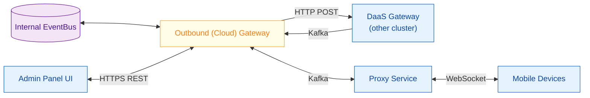
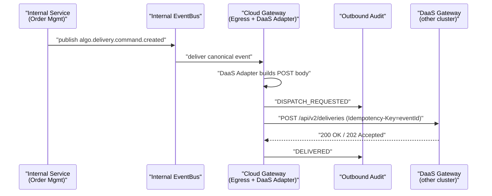
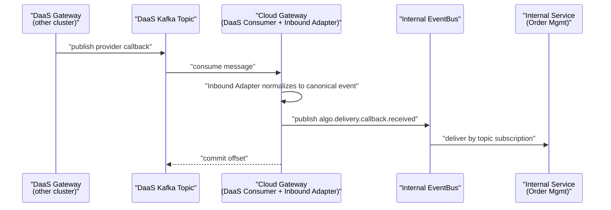
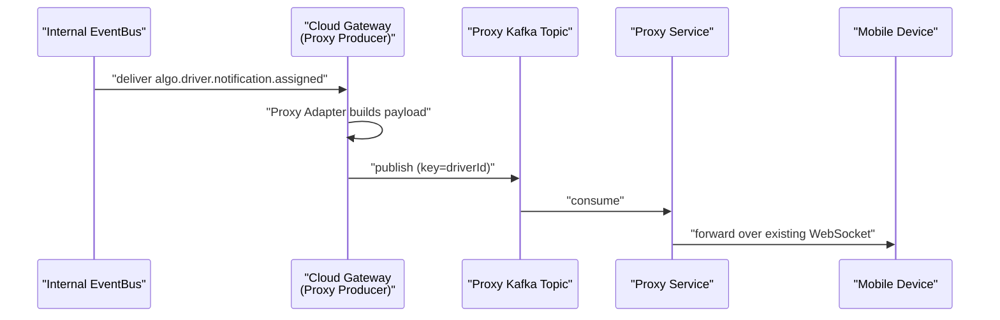
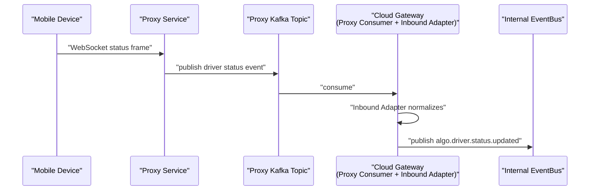
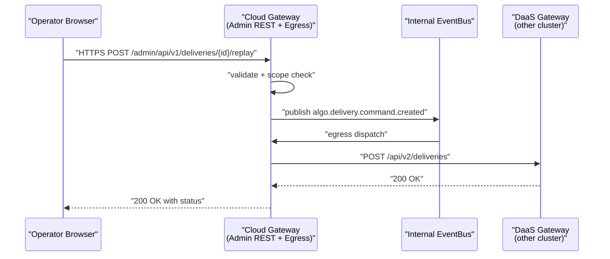

# Algo 4 - Outbound (Cloud) API Gateway HLD

## Purpose

Algo 4 needs an Outbound (Cloud) API Gateway that owns the egress and bidirectional boundary of the Algo 4 cloud cluster. It is the only Algo 4 component that talks to:

- The `DaaS Gateway`, which lives in a different cluster (today: `bitbucket.org/dragontailcom/daas-gateway`).
- The Admin Panel UI used by human operators.
- The `Proxy Service`, which forwards events to mobile devices.

The Cloud Gateway is responsible for:

- Translating canonical Algo events from the internal EventBus into transport-specific payloads (HTTP to DaaS, Kafka to Proxy, REST to Admin UI).
- Receiving asynchronous events from DaaS and Proxy and re-publishing them as canonical Algo events on the internal EventBus.
- Tracking outbound delivery outcomes for audit, retry, idempotency, and DLQ behavior.

The Cloud Gateway is the outbound mirror of the Inbound API Gateway: the Inbound Gateway turns external `POST` traffic into canonical Algo events, and the Cloud Gateway takes canonical Algo events and routes them outward, while converting async events from external systems back into canonical events.

## Migration Context: Replacing RabbitMQ Between The DaaS Cluster And Algo

Today the `DaaS Gateway` (in its own cluster) talks to Algo services using RabbitMQ. Algo 4 removes that RabbitMQ link. The new model is cluster-to-cluster:

- `Algo Cloud Gateway -> DaaS Gateway`: HTTP `POST` requests (replaces RabbitMQ commands sent from Algo to DaaS).
- `DaaS Gateway -> Algo Cloud Gateway`: Kafka events (replaces RabbitMQ events sent from DaaS to Algo).

After the migration, RabbitMQ is no longer part of the boundary between Algo and the DaaS cluster.

## Scope

### In Scope

- Subscribe to internal EventBus topics that need to be dispatched outward (DaaS / Proxy / Admin UI).
- Send `POST` HTTP requests to DaaS Gateway with retry, timeout, circuit breaking, signing, and outcome tracking.
- Consume Kafka topics published by DaaS Gateway and re-publish them as canonical Algo events.
- Publish Kafka events to Proxy Service for fan-out to mobile devices.
- Consume Kafka events from Proxy Service that originate from mobile devices.
- Serve the Admin Panel UI over HTTP REST.
- Authenticate and authorize Admin UI users.
- Authenticate outbound DaaS calls (signing / mTLS / token, TBD).
- Enforce idempotency on outbound dispatch and on inbound DaaS / Proxy events.
- Track every outbound delivery attempt and result for audit and DLQ.

### Out of Scope For Now

- The DaaS Gateway implementation itself.
- The Proxy Service implementation and its WebSocket protocol with mobile devices.
- The mobile application.
- Final Auth Service contract for Admin UI users.
- Final Kafka cluster topology, retention, and partitioning policy.
- Final HTTP authentication scheme between Algo Cloud Gateway and DaaS Gateway.

## Current Design Summary

## Surfaces Owned By The Cloud Gateway

The Cloud Gateway sits between the internal EventBus and three external surfaces. Each surface has its own direction, transport, and adapter.

| Surface | Direction (relative to Cloud GW) | Transport | Replaces |
| --- | --- | --- | --- |
| Internal EventBus | both | Kafka | n/a |
| DaaS Gateway (other cluster) | Cloud GW -> DaaS | HTTP `POST` | RabbitMQ commands Algo -> DaaS |
| DaaS Gateway (other cluster) | DaaS -> Cloud GW | Kafka | RabbitMQ events DaaS -> Algo |
| Proxy Service | Cloud GW -> Proxy | Kafka | n/a (new boundary) |
| Proxy Service | Proxy -> Cloud GW | Kafka | n/a (new boundary) |
| Admin Panel UI | both | HTTPS REST | n/a |
| Mobile Devices | indirect, via Proxy | WebSocket (Proxy <-> Mobile only) | unchanged |

The Cloud Gateway never speaks WebSocket. The Proxy Service owns the WS connections to mobile devices.

## Gateway Responsibilities

### 1. Egress Dispatcher

Subscribes to internal EventBus topics that contain canonical Algo events whose `eventType` or routing context implies an outbound destination.

For each consumed event, the dispatcher decides:

- Which destination(s) it must be sent to (DaaS, Proxy, Admin UI).
- Which adapter to invoke for each destination.
- Whether the event is idempotent on the destination side, and what idempotency key to use.

The dispatcher is a router only. It does not implement transport, signing, or destination-specific payload shapes. Those live in the adapters.

### 2. DaaS Adapter and HTTP Client

Translates canonical Algo events into DaaS Gateway HTTP request bodies and dispatches them as `POST` requests across the cluster boundary.

The HTTP client is responsible for:

- Connection pooling and keep-alive.
- Configurable per-route timeouts.
- Retry policy with exponential backoff and jitter.
- Circuit breaker per DaaS route.
- Request signing or auth header injection (final scheme TBD).
- Adding a stable idempotency identifier so DaaS can dedupe retries.
- Converting DaaS HTTP responses into outbound delivery statuses.
- Recording every attempt to outbound audit.

DaaS HTTP failures are not surfaced back to the originating internal service. The Cloud Gateway absorbs them and uses retry / DLQ semantics.

### 3. DaaS Kafka Consumer

Consumes Kafka topics that the DaaS Gateway publishes (callbacks from aggregators, delivery status updates, provider events, etc.).

For each message:

- The consumer hands the raw payload to the inbound adapter layer.
- The adapter normalizes the DaaS-specific shape into a canonical Algo event.
- The canonical event is published to the internal EventBus.
- The consumer commits offsets only after a successful publish to the internal bus, or after the message has been routed to a retry / DLQ topic.

This subsystem replaces the RabbitMQ-based event flow `DaaS cluster -> Algo`.

### 4. Proxy Kafka Producer

Publishes canonical Algo events to Proxy topics. The Proxy Service then forwards those events to mobile devices over its own WebSocket connections (unchanged by Algo 4).

Concerns:

- Per-device, per-driver, or per-store routing context must be present in the event so Proxy can target the right WS connection.
- Order management and delivery progress events typically have ordering requirements. Partition keys should be derived from a stable identifier (store ID, driver ID, order ID, etc.).
- Proxy publish failures use the same retry / DLQ pattern as the DaaS HTTP path.

### 5. Proxy Kafka Consumer

Consumes Kafka topics produced by the Proxy Service when mobile devices send events upward (status updates, location updates, ack/nack, login/logout). The flow inside the Cloud Gateway mirrors the DaaS Kafka consumer flow:

- Inbound adapter normalizes the proxy-shaped payload into a canonical Algo event.
- The canonical event is published to the internal EventBus.
- Offsets are committed after successful re-publish.

### 6. Admin Panel UI: REST API

The Admin UI is a human-facing surface served over HTTPS REST.

It supports:

- CRUD-style operations: read store config, change provider settings, view audit, replay events, manage users.
- Polling / paged reads of recent events for an operator dashboard.
- Operator-triggered actions, which the gateway turns into canonical Algo events and publishes onto the internal EventBus, or dispatches directly through the Egress Dispatcher when the action is itself an outbound dispatch (for example, a manual replay to DaaS).

Authentication for Admin UI users is TBD and is an explicit design gap (likely OIDC, session cookie, or signed JWT). Per-user scoping by brand / country / store is enforced at the gateway on every REST request.

The Admin UI does not use WebSocket. Live-feed style requirements are served via REST polling for now.

### 7. Inbound Adapter Layer

The Cloud Gateway has a symmetric adapter layer for inbound traffic. There are at least three adapters:

- DaaS Kafka adapter.
- Proxy Kafka adapter.
- Admin UI REST action adapter.

Each adapter produces the same canonical Algo event envelope used elsewhere in Algo 4 (see `CLAUDE.md` for the inbound event envelope). The internal EventBus does not need to know which surface produced the event.

### 8. Outbound Audit Store

Every outbound delivery attempt is recorded with:

- `eventId` and `correlationId`.
- Destination (DaaS / Proxy / Admin REST response).
- Adapter version.
- Request payload reference (or hash).
- HTTP status / Kafka publish status.
- Attempt number and retry decision.
- Final status (DELIVERED / FAILED / RETRYING / DEAD_LETTERED).
- Timestamps.

Outbound audit is separate from the Inbound Audit Service used by the Inbound Gateway, but the schema should be similar so they can be unified later.

### 9. Idempotency / Dedupe Store

Required for two paths:

- Outbound dispatch: avoid double-sending the same canonical event to DaaS or Proxy after retries.
- Inbound consumption: avoid double-publishing the same DaaS or Proxy event into the internal EventBus when Kafka redelivers.

Possible idempotency keys:

- Cloud-side `eventId`.
- DaaS-supplied event identifier on the inbound side.
- Proxy-supplied message identifier on the inbound side.
- `(sourceSystem, sourceEventId, eventType)` tuple as fallback.

## Outbound Delivery Outcome Model

Each outbound dispatch is tracked through clear internal statuses.

| Status | Meaning |
| --- | --- |
| `DISPATCH_REQUESTED` | Cloud GW received an internal canonical event for a known outbound destination. |
| `ADAPTED` | Adapter successfully built the destination-specific payload. |
| `IN_FLIGHT` | Transport call started (HTTP request sent / Kafka publish issued). |
| `DELIVERED` | Destination acknowledged the message (HTTP 2xx or Kafka ack). |
| `DELIVERY_FAILED` | Transport-layer failure (non-2xx HTTP, Kafka error). |
| `RETRYING` | Scheduled for retry under the configured policy. |
| `DEAD_LETTERED` | Retries exhausted or message classified as non-retryable. |

For the inbound side (DaaS / Proxy / Admin into internal EventBus), reuse the inbound statuses already defined in `CLAUDE.md` (`RECEIVED`, `RAW_STORED`, `VALIDATED`, `NORMALIZED`, `PUBLISHED`, etc.) so a single mental model covers both gateways.

## Canonical Algo Event Reuse

The Cloud Gateway uses the same canonical Algo event envelope defined in `CLAUDE.md` for the Inbound Gateway. This is mandatory so internal services do not see two different event shapes depending on origin.

For outbound traffic, the relevant fields are:

- `eventId`: stable cloud-side identifier; used as the idempotency key by default.
- `correlationId`: traces an action across inbound, internal, and outbound legs.
- `eventType`: business event name, used by the Egress Dispatcher to choose destinations.
- `sourceSystem`: helpful for cycle detection so a DaaS-originated event does not get sent back to DaaS.
- `brandId`, `country`, `storeId`: required routing context for DaaS, Proxy, and Admin UI scoping.
- `data`: destination adapters take this and build their transport payload.

For inbound traffic, the Cloud Gateway adapters set:

- `sourceSystem` to `daas-gateway`, `proxy-service`, or `admin-ui`.
- `sourceEventId` to whatever stable identifier the upstream provided.
- `rawRequestRef` to the location of the original payload if it is preserved.

## Topic Naming

The topic naming convention, event catalog, and subscription patterns are defined in `docs/event-taxonomy.md`. That document is the source of truth for topic structure, naming rules, and per-domain event lists.

## DaaS HTTP Contract Notes

The Cloud Gateway calls DaaS routes such as those in `bitbucket.org/dragontailcom/daas-gateway/api/handler` (for example `/api/v1/...`, `/api/v2/deliveries`, `/api/v2/deliveries/quotes`, `/api/v2/deliveries/eta`, `/callbacks/...`).

Required behavior on the cloud side:

- Use `Content-Type: application/json` per DaaS expectations.
- Forward `request-id` / trace headers so DaaS can correlate.
- Treat `2xx` as success, `4xx` as non-retryable failure (audit only), `5xx` and timeouts as retryable.
- Carry a stable `Idempotency-Key` derived from `eventId` so DaaS can dedupe on retry.
- Pass `brand`, `country`, `storeNo`, and any provider routing fields the DaaS handlers expect.
- For quote-style flows, treat the `202 Accepted` async response from DaaS as a normal lifecycle stage; the actual quote answer arrives later through the DaaS Kafka consumer path.

The exact DaaS contract may change as DaaS retires its RabbitMQ surface. The Cloud Gateway should keep the DaaS adapter narrow so contract drift is contained.

## Proxy Service Contract Notes

- Cloud -> Proxy is one-way Kafka publish from the Cloud Gateway.
- Proxy -> Cloud is one-way Kafka publish from the Proxy Service.
- Proxy <-> Mobile remains WebSocket and is not changed by Algo 4.
- Routing context (driver, store, device) must be encoded in the event so Proxy can pick the target WS connection.
- Topic partitioning should align with whatever sharding key Proxy uses to keep ordering per device.

## Admin Panel UI Contract Notes

- HTTPS REST endpoints under `/admin/api/v1/*` (suggested).
- Auth required. Final mechanism TBD.
- Per-user scoping by brand / country / store enforced at the gateway, never trusted from the client.
- JSON request/response bodies. Pagination on list endpoints.
- No WebSocket; if a near-real-time view is needed later it should be added as a separate concern.

## Request / Event Flow Examples

### Cloud sends a delivery command to DaaS

### DaaS pushes a provider callback into Algo

### Cloud notifies a mobile driver via Proxy

### Mobile sends a status update upward via Proxy

### Operator triggers a replay from the Admin UI

## Failure Handling

### DaaS HTTP Failure

- Classify by status: `2xx` success, `4xx` non-retryable failure, `5xx` and network errors retryable.
- Mark status `DELIVERY_FAILED` with the response classification.
- Retry under exponential backoff with jitter, bounded by max attempts.
- Trip the circuit breaker on sustained failures per DaaS route.
- Move to DLQ after retries are exhausted, preserving original canonical event and all attempt metadata.

### DaaS Kafka Consumer Failure

- A failure to publish into the internal EventBus must not commit the offset.
- Use a poison-message handler to send malformed DaaS payloads to a DaaS-DLQ topic with the parsing error, while still committing the offset on the source topic.
- Inbound adapter validation failures behave the same way.

### Proxy Producer / Consumer Failure

- Same retry / DLQ pattern as DaaS for both directions.
- Proxy DLQ should be separate from DaaS DLQ for blast-radius reasons.

### Admin UI Failure

- REST failures return standard HTTP error codes with structured error bodies.
- The gateway must not block internal EventBus consumption because of slow Admin UI clients; per-request timeouts apply.

## Idempotency

External destinations may dedupe based on identifiers the cloud provides. External sources may also redeliver after partial failures. The Cloud Gateway must:

- Always send a stable `Idempotency-Key` to DaaS derived from `eventId`.
- Always include a stable identifier when publishing to Proxy.
- Dedupe inbound DaaS / Proxy messages on the source-supplied identifier where one exists, falling back to a hash of stable raw fields.
- Apply dedupe before re-publishing to the internal EventBus.

## Observability

Structured logs, metrics, and traces using `eventId` and `correlationId`, mirroring the Inbound Gateway requirements.

Recommended metrics:

- Outbound dispatches by destination (`daas`, `proxy`, `admin`).
- HTTP outcome distribution to DaaS (`2xx`, `4xx`, `5xx`, timeout).
- Circuit breaker state per DaaS route.
- Proxy publish success / failure.
- Admin REST request count, latency, error rate.
- DaaS Kafka consumer lag.
- Proxy Kafka consumer lag.
- Inbound -> internal publish success / failure.
- Retry count and DLQ count per direction and per destination.

Recommended log fields:

- `eventId`
- `correlationId`
- `direction` (`outbound` / `inbound`)
- `destination` (`daas`, `proxy`, `admin`) or `source`
- `eventType`
- `brandId` / `country` / `storeId`
- `attempt`
- `outcome`

## Security And Privacy

- Auth scheme between Algo Cloud Gateway and DaaS Gateway must be selected before production. Candidates: HMAC request signature, mTLS, OAuth client credentials, signed JWT.
- Auth scheme for Admin UI users must be selected. Candidates: OIDC, session cookies, signed JWT.
- Admin UI per-user scoping (brand / country / store) must be enforced at the gateway on every REST request.
- Outbound audit data may contain PII. Retention, access control, and encryption rules apply.
- Logs must avoid full payload dumps; use stable references / hashes instead.
- Rate limiting per Admin UI user and per outbound DaaS route should be configurable.
- Payload size limits must be enforced on both inbound and outbound paths.

## Open Decisions

| Decision | Current Status |
| --- | --- |
| Auth scheme Cloud GW <-> DaaS Gateway | TBD (HMAC / mTLS / OAuth / JWT) |
| Auth scheme Admin UI users | TBD (OIDC / session / JWT) |
| Topic naming convention | Defined in `docs/event-taxonomy.md` |
| Idempotency key strategy on DaaS HTTP | TBD (default: `eventId`) |
| Outbound retry / DLQ policy | TBD |
| Outbound audit storage technology | TBD |
| Per-user scope model for Admin UI | TBD |
| Whether to add a near-real-time channel for Admin UI later | TBD (REST only for now) |

## Recommended Next Steps

1. Choose the auth scheme between Algo Cloud Gateway and DaaS Gateway, and define the request signing contract.
2. Choose the auth scheme for Admin UI users, including per-user scope model.
3. Inventory the DaaS HTTP routes the cloud actually needs, and lock the cloud-side adapter contract for each.
4. Inventory the DaaS Kafka events the cloud needs to consume, and lock the inbound adapter contract for each.
5. Define the Proxy Kafka topic schema and partition keys per event family.
6. Finalize the outbound delivery outcome model and the audit schema.
7. Define retry and DLQ policy per direction and per destination.
8. Add one sequence diagram per critical business flow that crosses the cloud boundary.

## Notes On Current System

- DaaS Gateway today is a Go service at `bitbucket.org/dragontailcom/daas-gateway` running in a separate cluster. It uses `chi` for HTTP, `rabbitmq/amqp091-go` for messaging, and Postgres for persistence.
- DaaS already exposes HTTP routes such as `/api/v1/*`, `/api/v2/deliveries`, `/api/v2/deliveries/quotes`, `/api/v2/deliveries/eta`, and `/callbacks/{brand}/{country}/{storeNo}`. The cloud-side DaaS adapter should target this surface rather than introducing a parallel one.
- Proxy <-> Mobile remains WebSocket; the migration only affects the Proxy <-> Algo link, which becomes Kafka.
- The Inbound Gateway and the Outbound (Cloud) Gateway share the same canonical Algo event envelope and the same structured-logging conventions; they should be operated as a pair.
