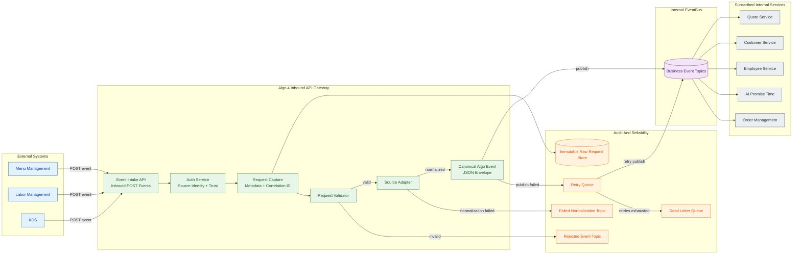

# Algo 4 Inbound API Gateway Implementation Plan

> **For Claude:** REQUIRED SUB-SKILL: Use superpowers:executing-plans to implement this plan task-by-task.

**Goal:** Build the Algo 4 inbound API Gateway that receives external POST requests, stores immutable raw payloads, validates and normalizes requests, and publishes canonical Algo events to the internal EventBus.

**Architecture:** The Gateway is an ingestion boundary. It accepts external events from Menu Management, Labor Management, and KDS, authenticates callers through the Auth Service, persists raw data, validates and adapts source payloads into a stable JSON event envelope, and publishes to EventBus topics. Internal services subscribe to topics instead of being called directly by the Gateway.

**Tech Stack:** Go, HTTP API, JSON payloads, pluggable raw storage, pluggable EventBus publisher, structured logs, Go tests.

---

## Implementation Principles

- Keep the Gateway focused on inbound ingestion, normalization, and publishing.
- Do not encode downstream service-specific behavior in the Gateway.
- Keep source-specific logic inside adapters.
- Persist raw payloads before validation so invalid requests are still auditable.
- Use a canonical event envelope with a variable `data` payload.
- Treat the Auth Service contract, raw storage technology, and EventBus technology as replaceable interfaces until final platform decisions are made.
- Use TDD for each component.

## Target Architecture



## Proposed Project Layout

```text
cmd/algo4-gateway/main.go
internal/gateway/http/handler.go
internal/gateway/http/handler_test.go
internal/gateway/auth/auth.go
internal/gateway/auth/auth_test.go
internal/gateway/rawstore/store.go
internal/gateway/rawstore/memory_store.go
internal/gateway/rawstore/memory_store_test.go
internal/gateway/validation/validator.go
internal/gateway/validation/validator_test.go
internal/gateway/adapter/adapter.go
internal/gateway/adapter/adapter_test.go
internal/gateway/events/event.go
internal/gateway/events/event_test.go
internal/gateway/publisher/publisher.go
internal/gateway/publisher/memory_publisher.go
internal/gateway/publisher/memory_publisher_test.go
internal/gateway/observability/logging.go
docs/design/inbound-api-gateway-hld.md
docs/plans/2026-05-14-inbound-api-gateway.md
```

## Canonical Event Envelope

Use this as the first implementation target:

```json
{
  "eventId": "uuid",
  "correlationId": "uuid-or-source-correlation-id",
  "eventType": "algo.menu.updated",
  "schemaVersion": "v1",
  "sourceSystem": "menu-management",
  "sourceEventId": "external-id-if-provided",
  "brandId": "brand-or-tenant",
  "country": "country-code",
  "storeId": "external-store-id",
  "receivedAt": "RFC3339 timestamp",
  "occurredAt": "RFC3339 timestamp if provided by source",
  "rawRequestRef": "raw-store-key-or-id",
  "validationStatus": "VALIDATED",
  "data": {}
}
```

## Task 1: Scaffold Go Module

**Files:**

- Create: `go.mod`
- Create: `cmd/algo4-gateway/main.go`

**Step 1: Initialize the Go module**

Run:

```bash
go mod init bitbucket.org/dragontailcom/algo-4
```

Expected: `go.mod` exists with module name `bitbucket.org/dragontailcom/algo-4`.

**Step 2: Add a minimal main**

Create `cmd/algo4-gateway/main.go`:

```go
package main

import "fmt"

func main() {
	fmt.Println("algo-4 inbound gateway")
}
```

**Step 3: Verify**

Run:

```bash
go test ./...
go run ./cmd/algo4-gateway
```

Expected: tests pass and the command prints `algo-4 inbound gateway`.

**Step 4: Commit checkpoint**

Only commit if explicitly requested:

```bash
git add go.mod cmd/algo4-gateway/main.go
git commit -m "chore: scaffold algo 4 gateway"
```

## Task 2: Define Core Event Types

**Files:**

- Create: `internal/gateway/events/event.go`
- Create: `internal/gateway/events/event_test.go`

**Step 1: Write failing tests**

Create tests for:

- Required event fields.
- JSON marshaling uses expected field names.
- `receivedAt` is present.
- `validationStatus` supports known values.

Example:

```go
func TestCanonicalEventMarshalJSON(t *testing.T) {
	event := CanonicalEvent{
		EventID:          "evt-1",
		CorrelationID:    "corr-1",
		EventType:        "algo.menu.updated",
		SchemaVersion:    "v1",
		SourceSystem:     "menu-management",
		StoreID:          "store-1",
		RawRequestRef:    "raw-1",
		ValidationStatus: ValidationStatusValidated,
		Data:             json.RawMessage(`{"menuId":"menu-1"}`),
	}

	body, err := json.Marshal(event)
	require.NoError(t, err)
	require.JSONEq(t, `{
		"eventId":"evt-1",
		"correlationId":"corr-1",
		"eventType":"algo.menu.updated",
		"schemaVersion":"v1",
		"sourceSystem":"menu-management",
		"storeId":"store-1",
		"rawRequestRef":"raw-1",
		"validationStatus":"VALIDATED",
		"data":{"menuId":"menu-1"}
	}`, string(body))
}
```

**Step 2: Run test to verify it fails**

Run:

```bash
go test ./internal/gateway/events -v
```

Expected: fail because types do not exist yet.

**Step 3: Implement event types**

Create:

- `CanonicalEvent`
- `ValidationStatus`
- constants for `RECEIVED`, `RAW_STORED`, `VALIDATED`, `REJECTED`, `NORMALIZED`, `PUBLISHED`, `PUBLISH_FAILED`, `DEAD_LETTERED`

**Step 4: Verify**

Run:

```bash
go test ./internal/gateway/events -v
```

Expected: pass.

## Task 3: Implement Raw Request Store Interface

**Files:**

- Create: `internal/gateway/rawstore/store.go`
- Create: `internal/gateway/rawstore/memory_store.go`
- Create: `internal/gateway/rawstore/memory_store_test.go`

**Step 1: Write failing tests**

Test that the raw store:

- Stores exact request bytes without modification.
- Stores metadata.
- Returns a stable raw request reference.
- Allows fetching by reference for replay/debugging.

**Step 2: Define raw request model**

Include:

- Raw body bytes.
- Headers.
- Method.
- Path.
- Source system.
- Received timestamp.
- Correlation ID.
- Validation status.

**Step 3: Implement in-memory store**

Use this for initial development and tests. Keep the interface ready for database or object storage later.

**Step 4: Verify**

Run:

```bash
go test ./internal/gateway/rawstore -v
```

Expected: pass.

## Task 4: Implement Request Validation

**Files:**

- Create: `internal/gateway/validation/validator.go`
- Create: `internal/gateway/validation/validator_test.go`

**Step 1: Write failing tests**

Cover:

- Valid request passes.
- Missing source system fails.
- Missing or unsupported event type fails.
- Empty body fails.
- Payload larger than configured limit fails.

**Step 2: Implement validator**

Keep validation generic:

- Required metadata exists.
- Payload is valid JSON.
- Event type is supported.
- Source system is known or allowed.

**Step 3: Verify**

Run:

```bash
go test ./internal/gateway/validation -v
```

Expected: pass.

## Task 5: Implement Adapter Registry

**Files:**

- Create: `internal/gateway/adapter/adapter.go`
- Create: `internal/gateway/adapter/adapter_test.go`

**Step 1: Write failing tests**

Cover:

- Registry selects adapter by source system and event type.
- Missing adapter returns a typed error.
- Adapter receives raw payload and returns canonical `data`.
- Adapter does not mutate raw payload.

**Step 2: Define adapter interface**

Suggested interface:

```go
type Adapter interface {
	Normalize(ctx context.Context, input Input) (Output, error)
}
```

**Step 3: Implement registry**

Map adapters by `sourceSystem` and `eventType`.

**Step 4: Add a sample source adapter**

Create a simple test adapter that maps a Menu Management, Labor Management, or KDS payload into the matching canonical Algo event.

**Step 5: Verify**

Run:

```bash
go test ./internal/gateway/adapter -v
```

Expected: pass.

## Task 6: Implement Event Publisher Interface

**Files:**

- Create: `internal/gateway/publisher/publisher.go`
- Create: `internal/gateway/publisher/memory_publisher.go`
- Create: `internal/gateway/publisher/memory_publisher_test.go`

**Step 1: Write failing tests**

Cover:

- Publishing records topic and event body.
- Publish failure returns an error.
- Publisher receives canonical event envelope.

**Step 2: Define publisher interface**

Suggested interface:

```go
type Publisher interface {
	Publish(ctx context.Context, topic string, event events.CanonicalEvent) error
}
```

**Step 3: Implement memory publisher**

Use this as a test double until the real EventBus is chosen.

**Step 4: Verify**

Run:

```bash
go test ./internal/gateway/publisher -v
```

Expected: pass.

## Task 7: Implement HTTP Inbound Handler

**Files:**

- Create: `internal/gateway/http/handler.go`
- Create: `internal/gateway/http/handler_test.go`
- Modify: `cmd/algo4-gateway/main.go`

**Step 1: Write failing tests**

Cover:

- Valid POST stores raw request.
- Valid POST validates, normalizes, and publishes event.
- Handler returns `200` or `202`.
- Invalid request stores raw request and returns acknowledgement.
- Invalid request does not expose internal validation details.
- Publish failure records failure and still returns controlled response.

**Step 2: Implement handler dependencies**

Handler should depend on interfaces:

- Auth Service client.
- Raw store.
- Validator.
- Adapter registry.
- Publisher.
- Logger.

**Step 3: Implement request flow**

Order:

1. Receive request.
2. Attach or generate correlation ID.
3. Authenticate caller through the Auth Service interface.
4. Store raw body and metadata.
5. Validate request.
6. Normalize through adapter.
7. Publish canonical event.
8. Return acknowledgement.

**Step 4: Wire main**

Expose initial event intake route:

```text
POST /inbound/events
```

**Step 5: Verify**

Run:

```bash
go test ./internal/gateway/http -v
go test ./...
```

Expected: pass.

## Task 8: Add Idempotency

**Files:**

- Create: `internal/gateway/idempotency/store.go`
- Create: `internal/gateway/idempotency/memory_store.go`
- Create: `internal/gateway/idempotency/memory_store_test.go`
- Modify: `internal/gateway/http/handler.go`
- Modify: `internal/gateway/http/handler_test.go`

**Step 1: Write failing tests**

Cover:

- Duplicate `sourceEventId` does not publish twice.
- Duplicate `Idempotency-Key` header does not publish twice.
- Missing explicit key falls back to stable hash behavior if implemented.

**Step 2: Implement idempotency interface**

Keep it storage-agnostic so it can later use Redis, SQL, or another store.

**Step 3: Integrate before publish**

Deduplicate after raw storage and validation, before publishing.

**Step 4: Verify**

Run:

```bash
go test ./internal/gateway/idempotency -v
go test ./internal/gateway/http -v
go test ./...
```

Expected: pass.

## Task 9: Add Retry And DLQ Contracts

**Files:**

- Create: `internal/gateway/retry/policy.go`
- Create: `internal/gateway/retry/policy_test.go`
- Modify: `internal/gateway/publisher/publisher.go`
- Modify: `internal/gateway/http/handler.go`

**Step 1: Write failing tests**

Cover:

- Retryable publish failure is marked `PUBLISH_FAILED`.
- Exhausted retries marks event `DEAD_LETTERED`.
- Non-retryable normalization failure is routed to failed-normalization handling.

**Step 2: Implement retry policy**

Keep first version simple:

- Max attempts.
- Backoff duration.
- Retryable error classification.

**Step 3: Add DLQ interface**

Define a dead-letter publisher interface without committing to technology.

**Step 4: Verify**

Run:

```bash
go test ./internal/gateway/retry -v
go test ./...
```

Expected: pass.

## Task 10: Add Observability

**Files:**

- Create: `internal/gateway/observability/logging.go`
- Create: `internal/gateway/observability/metrics.go`
- Modify: `internal/gateway/http/handler.go`
- Modify: `internal/gateway/http/handler_test.go`

**Step 1: Write tests**

Cover that handler emits or passes:

- `eventId`
- `correlationId`
- `sourceSystem`
- `eventType`
- `storeId`
- `validationStatus`
- `publishStatus`
- `rawRequestRef`

**Step 2: Implement structured log fields**

Avoid logging full raw payloads.

**Step 3: Add metric names**

Initial metrics:

- `gateway_requests_total`
- `gateway_raw_store_failures_total`
- `gateway_validation_failures_total`
- `gateway_normalization_failures_total`
- `gateway_publish_failures_total`
- `gateway_dead_letter_total`
- `gateway_publish_latency_ms`

**Step 4: Verify**

Run:

```bash
go test ./internal/gateway/observability -v
go test ./...
```

Expected: pass.

## Task 11: Move HLD Into Docs

**Files:**

- Create: `docs/design/inbound-api-gateway-hld.md`
- Modify: `CLAUDE.md`

**Step 1: Copy the current HLD**

Move the design content from `CLAUDE.md` into `docs/design/inbound-api-gateway-hld.md`.

**Step 2: Keep `CLAUDE.md` as agent guidance**

Update `CLAUDE.md` to point to:

- `docs/design/inbound-api-gateway-hld.md`
- `docs/plans/2026-05-14-inbound-api-gateway.md`

**Step 3: Verify**

Read both files and confirm they are not duplicating large sections unnecessarily.

## Task 12: Final Verification

**Step 1: Run all tests**

```bash
go test ./...
```

Expected: all tests pass.

**Step 2: Run the Gateway locally**

```bash
go run ./cmd/algo4-gateway
```

Expected: server starts and listens on the configured port.

**Step 3: Send a sample request**

```bash
curl -i -X POST http://localhost:8080/inbound/events \
  -H "Content-Type: application/json" \
  -H "X-Source-System: menu-management" \
  -H "Idempotency-Key: demo-1" \
  -d '{"eventType":"algo.menu.updated","menuId":"menu-1","storeId":"store-1"}'
```

Expected:

- HTTP response is `200` or `202`.
- Raw payload is stored exactly as sent.
- Canonical event is published through the configured publisher.
- Logs contain `eventId` and `correlationId`.

## Open Decisions Before Production

- Choose external Auth Service method.
- Choose persistent raw request store.
- Choose EventBus technology and exact topic/routing rules.
- Choose persistent idempotency store.
- Choose retry and DLQ implementation.
- Define raw payload retention and PII policy.
- Finalize first production source adapter.

## Execution Options

Plan is saved to `docs/plans/2026-05-14-inbound-api-gateway.md`.

Option 1: Subagent-driven execution in this session. Each task is implemented by a focused subagent and reviewed before moving to the next task.

Option 2: Parallel session execution. Open a new session using the executing-plans workflow and implement this plan task-by-task with checkpoints.
