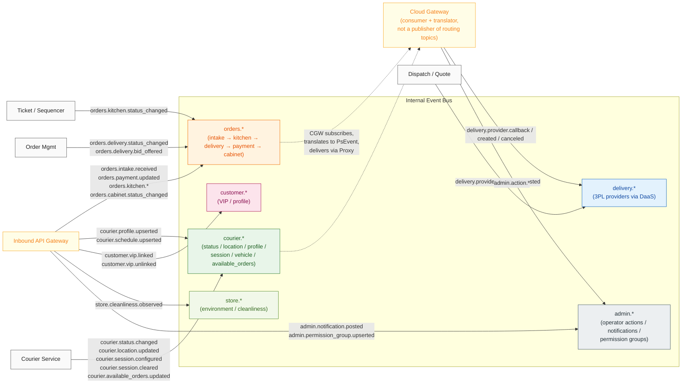
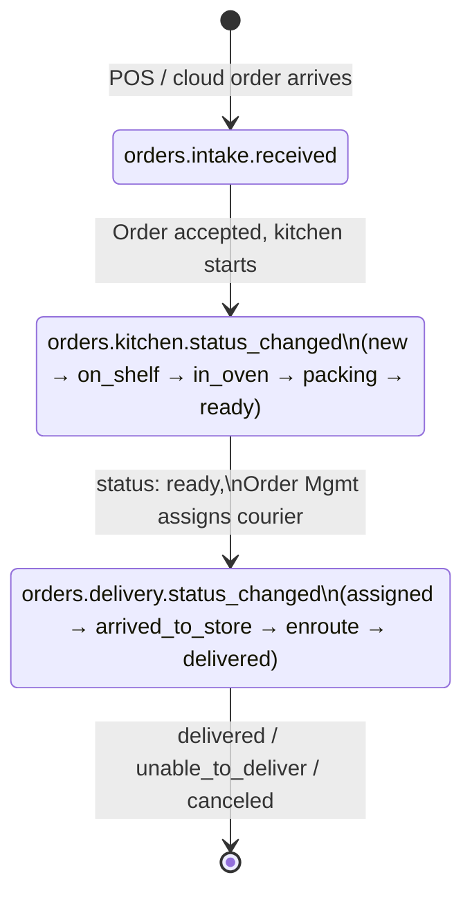
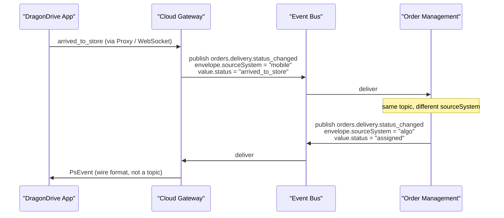
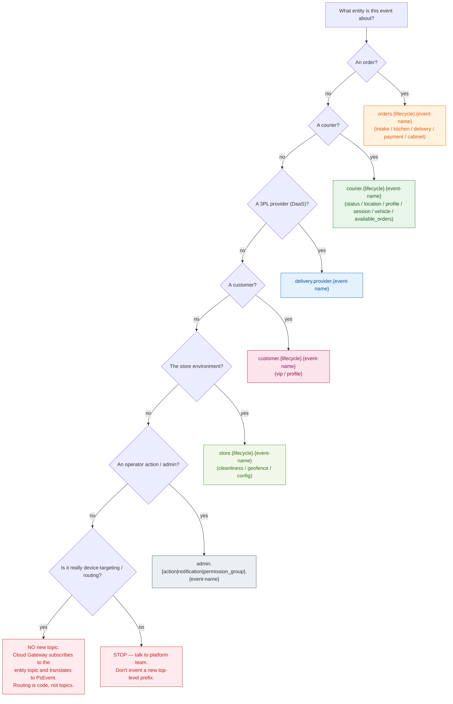

# Topics — Visual Overview

<!--
Team-facing explainer for the Algo 4 Event Bus topic model.

This is the "what and why" companion to docs/event-taxonomy.md.
- event-taxonomy.md = the catalog (every topic, every status, every payload).
- topics-overview.md = the model (the five domains, the anatomy of a name,
  the lifecycle, who publishes vs consumes, and the reasoning behind the
  decisions).

When in doubt about which topic to publish or subscribe to, start here.
Once you know the family, jump to event-taxonomy.md for the exact name.
-->

**Owner team:** Algo 4 Platform
**Status:** Draft
**Last updated:** 2026-05-24

---

## TL;DR (30 seconds)

1. **Every topic has the same shape:** `{domain}.{lifecycle}.{event-name}`, all `snake_case` within each level.
2. **There are six entity domains** — `orders`, `courier`, `delivery`, `customer`, `store`, `admin`. Pick the right one and the rest of the name almost writes itself.
3. **Topics name business facts about entities** — not transports, not targets, not directions. No `*-in` / `*-out` suffixes, no `*-to-makeline` / `*-to-mobile` target suffixes, no `gateway.mobile.*` transport prefixes, no `pos.*` / `kds.*` source prefixes.

If your event doesn't fit one of the six entity domains, that's a design discussion — not a license to invent a new prefix.

---

## 1. Why this doc exists

Early drafts had **three different names** floating around for the **same business event** ("a new order entered the cluster"):

| Where it appeared (draft) | Name used (draft) | Status |
|---|---|---|
| `docs/event-taxonomy.md` (catalog) | `orders.kitchen.status_changed` with `status: new` | superseded |
| `docs/inbound-api-gateway/README.md` (proposed) | `pos.order.received` | superseded |
| `docs/outbound-cloud-gateway/README.md` (proposed) | `algo.pos.order.received.v1` | superseded |

That was a recipe for orphan topics, double-publishing, and consumers who silently miss events. **Resolved:** the canonical name is **`orders.intake.received`** (an intake-lifecycle fact about an order). All three docs above now use that name. This doc captures the model so we never re-introduce the drift.

---

## 2. The model in one picture



The bus has six "shelves". Every event lands on one of them — keyed by the entity it's about, never by the transport that carries it or the system that produced it. The Cloud Gateway is a **consumer** of these entity topics that translates device-bound events into the device wire format (PsEvent) and forwards via Proxy; it does **not** publish its own routing topics.

---

## 3. Anatomy of a topic name

```
orders.intake.received
└──┬──┘ └──┬──┘ └──┬───┘
   │       │       │
   │       │       └── event-name : what happened, past tense, kebab-case
   │       │
   │       └── lifecycle : the phase within the domain
   │                       (intake / kitchen / delivery / payment / cabinet for orders;
   │                        status / location / profile / session / vehicle for courier;
   │                        provider for delivery; vip for customer;
   │                        cleanliness for store; action / notification / permission_group for admin)
   │
   └── domain : the business entity / aggregate
                (orders | courier | delivery | customer | store | admin)
```

Rules:

- Lowercase, dot-separated, kebab-case within each level.
- Past tense facts (`received`, `assigned`, `status_changed`) — never imperatives (`assign_courier`, `cancel_order`).
- **No direction suffix.** `*-in` / `*-out` is information that belongs in the envelope's `sourceSystem` field.
- **No version suffix.** Schema version lives in the envelope's `schemaVersion` field.
- **No service-target.** A topic does not name its consumer (`*-to-makeline`, `*-to-mobile`). Routing is the bus's job.

---

## 4. The six entity domains, in plain language

Every topic is keyed by the **business entity** the event is about. Transport (HTTP / WebSocket / Kafka), direction (in / out), source system (POS / KDS / mobile), and target (mobile / makeline / pos) are never part of the name — they go in the envelope or are handled by code.

| Domain | What it represents | Who typically publishes | Why it's its own shelf |
|---|---|---|---|
| `orders.*` | The lifecycle of an order — entering the cluster (intake), through kitchen prep, to delivery handoff, plus payment and cabinet status. | Inbound API Gateway (intake, payment, kitchen actions, cabinet), KDS / Ticket Service (kitchen status), Order Management (delivery, bids). | Orders are the central business aggregate. Every store-ops decision eventually touches one. |
| `courier.*` | Courier state **independent of any specific order** — login, geofence, GPS pings, roster, schedule, session config, available-orders list, vehicle assignment. | Courier (Vehicle) Service (mobile-sourced status/location), Order Management (session, available_orders), Inbound API Gateway (profile / schedule / vehicle from Labor Management). | A courier exists before and after any one order. Mixing courier presence into `orders.*` would couple unrelated lifecycles. |
| `delivery.*` | The Algo↔3PL boundary (DoorDash / Uber / Wolt / etc. via DaaS). | Dispatch / Quote (requests), Cloud Gateway (responses + callbacks). | 3PL traffic has its own ordering, retry, and partitioning needs. Keeping it separate prevents 3PL noise from drowning order traffic. |
| `customer.*` | Customer state — VIP linkage, profile, address dedupe. PII boundary. | Inbound API Gateway (from brand VIP / loyalty feeds), Customer Service (downstream). | Customers exist across many orders. Mixing customer attributes into `orders.*` would conflate per-order facts with persistent customer state. |
| `store.*` | Store-environment facts not tied to a specific order or courier — cleanliness camera, geofence events, store config snapshots. | Inbound API Gateway (cameras, sensors), Store Service (config). | A store is a real physical entity; its observations and config drift are first-class facts that don't belong to any one order. |
| `admin.*` | Operator-issued actions and metadata — Admin Panel writes, POS-posted station notifications, permission-group definitions. | Cloud Gateway (Admin Panel REST), Inbound API Gateway (POS notifications, permission groups). | Operator actions have their own retention / audit / ACL story regardless of which UI emitted them. |

**No `gateway.*` domain.** Earlier drafts proposed `gateway.mobile.push` / `gateway.mobile.reply` for device-bound messages. We dropped that: it named the transport, not the entity, and every payload it carried was already (or should be) an entity fact (`orders.delivery.status_changed`, `courier.session.configured`, `orders.delivery.bid_offered`, etc.). The Cloud Gateway subscribes to those entity topics, translates each one to the device wire format (PsEvent), and delivers via Proxy. Routing is code, not a topic.

**No source-system domains** (`pos.*`, `kds.*`, `vip.*`, `cabinet.*`, `labor.*`, `fleet.*`). The source identity lives in the envelope's `sourceSystem` field — it does not get its own topic family. A "new order" is `orders.intake.received` whether it came from a brand POS or a cloud-order publisher.

---

## 5. The order lifecycle, as topics



One order moves through three topics, each owned by a different service. That's by design — every phase has a different "source of truth" and a different consumer set.

Cross-cutting:
- `courier.*` events fire **in parallel** to the order lifecycle (a courier can be logged in with no order, between orders, or during one).
- `delivery.provider.*` events fire **inside** the delivery phase (3PL is one strategy for fulfilling the delivery; in-house couriers are another).

---

## 6. Topic ownership at a glance

### Order domain (`orders.*`) — keyed by `orderId`

| Topic | Publisher | Primary consumers |
|---|---|---|
| `orders.intake.received` | Inbound API Gateway | Order Mgmt, Ticket Service, Customer Service, AI Promise Time, Cloud Gateway |
| `orders.payment.updated` | Inbound API Gateway (from brand POS) | Order Mgmt |
| `orders.kitchen.status_changed` | KDS / Ticket Service | Order Mgmt, Dispatch (on `ready`), Admin Panel, Tracking |
| `orders.kitchen.action_recorded` | Inbound API Gateway (from vendor KDS) | Order Mgmt, Makeline projection |
| `orders.kitchen.batch_action_recorded` | Inbound API Gateway (from vendor KDS) | Audit / replay |
| `orders.kitchen.placement_changed` | Inbound API Gateway (from vendor KDS) | Order Mgmt, Makeline projection |
| `orders.kitchen.item_status_changed` | Inbound API Gateway (from vendor KDS) | Order Mgmt, Makeline projection |
| `orders.kitchen.item_analyzed` | Inbound API Gateway (from pack-station camera) | Vision projection |
| `orders.kitchen.matcher_observed` | Inbound API Gateway (from makeline matcher camera) | Vision projection |
| `orders.cabinet.status_changed` | Inbound API Gateway (from cabinet PUC) | Order Mgmt, Cabinet UI |
| `orders.delivery.status_changed` | Order Management | Cloud Gateway → DragonDrive, AI Promise Time, Customer Service, Delivery Management, Admin Panel |
| `orders.delivery.bid_offered` | Order Management | Cloud Gateway (delivers to courier device via Proxy) |

### Courier domain (`courier.*`) — keyed by `courierId`

| Topic | Publisher | Primary consumers |
|---|---|---|
| `courier.status.changed` | Courier Service (events sourced from mobile via Cloud Gateway) | Order Mgmt / Dispatch, AI Promise Time, Telematics, Admin Panel, Delivery Management |
| `courier.location.updated` | Courier Service (same path) | AI Promise Time, Telematics, Admin Panel |
| `courier.profile.upserted` | Inbound API Gateway (from brand POS Labor feed) | Employee / Courier Service |
| `courier.schedule.upserted` | Inbound API Gateway (from brand POS Labor feed) | Employee / Courier Service |
| `courier.session.configured` | Order Management (in response to `logged_in`, carries startup options + mobile params) | Cloud Gateway (delivers to device) |
| `courier.session.cleared` | Order Management (shift reset / clear-data command) | Cloud Gateway (delivers to device) |
| `courier.available_orders.updated` | Order Management (when a courier's offerable-orders list changes) | Cloud Gateway (delivers to device) |

### Delivery domain (`delivery.provider.*`) — keyed by `storeId`

| Topic | Publisher | Primary consumers |
|---|---|---|
| `delivery.provider.quote_requested` | Dispatch / Quote Service | Cloud Gateway (calls DaaS) |
| `delivery.provider.quote_received` / `quote_failed` | Cloud Gateway | Dispatch, Order Mgmt |
| `delivery.provider.created` / `create_failed` | Cloud Gateway | Order Mgmt, Dispatch |
| `delivery.provider.callback` / `eta_updated` | Cloud Gateway | Order Mgmt, Dispatch, AI Promise Time |
| `delivery.provider.canceled` | Cloud Gateway | Order Mgmt, Dispatch |

### Customer domain (`customer.*`) — keyed by `customerId` (or `vipKey`)

| Topic | Publisher | Primary consumers |
|---|---|---|
| `customer.vip.linked` | Inbound API Gateway (from brand VIP / loyalty) | Customer Service, Order Mgmt |
| `customer.vip.unlinked` | Inbound API Gateway (from brand VIP / loyalty) | Customer Service, Order Mgmt |

### Store domain (`store.*`) — keyed by `storeId`

| Topic | Publisher | Primary consumers |
|---|---|---|
| `store.cleanliness.observed` | Inbound API Gateway (from cleanliness camera) | Vision / QA projection, Admin Panel |

### Admin domain (`admin.*`) — keyed by `storeId`

| Topic | Publisher | Primary consumers |
|---|---|---|
| `admin.action.polygon_updated` | Cloud Gateway | Dispatch |
| `admin.action.store_updated` | Cloud Gateway | Store Service |
| `admin.action.provider_updated` | Cloud Gateway | Dispatch |
| `admin.action.replay_requested` | Cloud Gateway | Cloud Gateway |
| `admin.notification.posted` | Inbound API Gateway (from brand POS) | KDS / Makeline projection |
| `admin.permission_group.upserted` | Inbound API Gateway (from brand POS Labor feed) | Employee Service, Auth Service |

---

## 7. Direction lives on the envelope, not the topic

Mobile, POS, and DaaS all send events both ways. The temptation is to encode direction in the topic name (`couriers.*` for algo→app, `ext_couriers.*` for app→algo). **Don't.** Use the envelope.



Same topic. Different `sourceSystem`. Different `value.status`. Consumers filter by what they care about.

**Why?** Because adding a direction prefix doubles the topic count and forces every consumer to subscribe to two topics for "the same business fact". And a year from now, when a third source appears (an in-house dispatcher app, say), we'd be inventing a third prefix.

---

## 8. Picking the right topic — a decision tree



---

## 9. Things we explicitly decided **not** to do

| Anti-pattern | Why we don't do it | Use instead |
|---|---|---|
| `pos.*`, `kds.*`, `vip.*`, `cabinet.*`, `labor.*`, `fleet.*`, `kitchen.*` topics keyed by source system or producing surface | Couples the topic to the producer, not to the business fact. The next source for "a new order" would force a parallel topic. | Domain-keyed: `orders.intake.received` (with `sourceSystem` in the envelope), `courier.profile.upserted`, `customer.vip.linked`, `store.cleanliness.observed`, `admin.notification.posted`, `admin.permission_group.upserted`, etc. |
| `*-in` / `*-out` direction suffixes | Doubles topic count, forces consumers to subscribe twice for one fact. | One topic per fact, direction in the envelope. |
| `*-to-makeline`, `*-to-mobile` target suffixes, `gateway.mobile.push` / `gateway.mobile.reply` transport prefixes | Embeds routing/transport in the name. The bus is supposed to do the routing, and every payload behind these names is already an entity fact. | Publish the entity fact (`orders.delivery.status_changed`, `courier.session.configured`, `orders.delivery.bid_offered`, etc.); let the Cloud Gateway subscribe, filter, and translate to the device wire format in code. |
| `*.v1` / `*.v2` version suffixes | Forces a topic split every schema bump and silently strands old consumers. | `schemaVersion` in the envelope; consumers handle multi-version reads. |
| Imperative names (`assign_courier`, `cancel_order`) | Topics are **facts**, not RPCs. The bus is not a job queue. | Past-tense facts: `orders.delivery.status_changed` with `status: assigned`. |
| Kebab-case event-name segments (`status-changed`, `quote-requested`) | Inconsistent with our chosen convention. | `snake_case` within each level: `status_changed`, `quote_requested`, `permission_group`. |
| Service-name topics (`order-management-events`) | Couples consumers to a service's existence; renaming the service breaks every consumer. | Domain topics; services come and go, domains don't. |

---

## 10. How to add a new topic

Before opening a PR:

1. **Confirm the domain.** Walk the decision tree (§8). If you land on "STOP", talk to the Algo 4 Platform team — adding a new top-level domain is a cross-team decision.
2. **Confirm it's a fact, not a command.** If you want "tell service X to do Y", that's a sync API or an RPC, not a topic.
3. **Confirm direction is on the envelope.** If your proposed name has `-in`, `-out`, `-from-mobile`, `-to-pos` — rewrite it.
4. **Pick the partition key.** Same key as the rest of the domain unless you have a written reason. `orderId` for `orders.*`, `courierId` for `courier.*`, `customerId` (or `vipKey`) for `customer.*`, `storeId` for `delivery.*` / `store.*` / `admin.*`.
5. **Add a row** to `docs/event-taxonomy.md` §6 in the right domain table, with publisher, payload summary, and consumer list.
6. **Update the corresponding service doc** (`docs/{service}.md` §5 Events Emitted, §4 Events Consumed).

---

## 11. Open questions (carried from `event-taxonomy.md` §8)

- "Order changed" / "order modified" event after intake but before kitchen — fold into `orders.kitchen.status_changed` (new status `changed`) or carve out `orders.intake.changed`? **TBD.**
- Cancellation reason enum — needed for both `orders.delivery.status_changed: canceled` and `orders.delivery.status_changed: unable_to_deliver`. **Pending product input.**
- Idempotency-key implementation: best-practice pattern is a `processed_events` table keyed by `eventId` with a unique constraint and `INSERT ... ON CONFLICT DO NOTHING`. **Pending decision on the store (Redis / Postgres / etc.).**
- Schema registry: not chosen yet (Confluent Schema Registry / AWS Glue / equivalent). Compatibility mode (BACKWARD / FORWARD / FULL) needs to be picked before the first producer ships.
- Environment prefix in topic names (`prd.` / `dev.` / `stg.`): currently not in our convention. Most modern conventions include one. **Decide before first cluster comes up.**
- Internal vs published-language split: should `orders.delivery.status_changed` carry both internal Order Mgmt detail and the curated mobile view, or do we carve out an `orders.delivery.public_status_changed` integration topic? **TBD.**

---

## 12. Related diagrams

Each flow file shows a concrete cross-service interaction using the topic names from this doc:

| Flow | File |
|---|---|
| POS order insert (sync to OM + AI Promise Time, then publish `orders.intake.received`) | `docs/inbound-api-gateway/flow-pos-order-insert.mmd` |
| POS reconciliation / status-poll read-through to OM (no bus event) | `docs/inbound-api-gateway/flow-pos-reconciliation.mmd` |
| Inbound API Gateway top-level architecture | `docs/inbound-api-gateway/architecture.mmd` |
| Outbound Cloud Gateway top-level architecture | `docs/outbound-cloud-gateway/architecture.mmd` |
