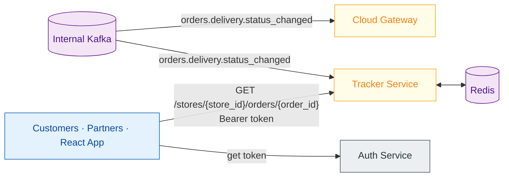

# Algo 4 - Tracker Service

**Owner team:** Algo 4 Platform
**Status:** Draft
**Last updated:** 2026-05-20

---

## 1. Purpose

The Tracker Service provides real-time order tracking for delivery orders. It consumes internal events, materializes a read-optimized view of order and carrier state, and exposes it as a public API to external customers, partner integrations, and the internal React Tracker app.

It is a **boundary service** — a peer of the Cloud Gateway, not downstream of it. Both subscribe to the internal Kafka EventBus independently. The Cloud Gateway handles DaaS / Proxy / Admin Panel; the Tracker Service handles the tracking API surface.

---

## 2. Architecture



---

## 3. Scope

### In Scope

- Consume `orders.delivery.status_changed` events to maintain current order state.
- Consume `courier.location.updated` events to maintain a rolling location buffer per order.
- Expose REST API for querying order status and courier locations.
- Authenticate callers via JWT (issued by Auth Service).
- Store state in Redis (stateless service, horizontally scalable).
- Support multiple order identifier types (POS order ID, Algo order ID, external order ID).
- Support both numeric store numbers and alphanumeric store identifiers.

### Out of Scope (current phase)

- Event forwarding / webhook subscriptions (future phase).
- GraphQL surface (under consideration).
- WebSocket / SSE for real-time push (REST polling is sufficient given 10-30s location update interval).
- DragonTrack (old customer-facing tracker embedded in Proxy) — coexists for now.

---

## 4. Events Consumed

| Event | Topic | What Tracker does with it |
|---|---|---|
| **OrderDeliveryStatusChanged** | `orders.delivery.status_changed` | Updates `currentStatus`, `dispatchedAt`, `lastUpdatedAt`, `eta` in Redis |
| **CourierLocationUpdated** | `courier.location.updated` | Appends to fixed-size location buffer (N latest points) in Redis |
| **DaasProviderCallback** | `delivery.provider.callback` | Updates `currentCarrierStatus` for 3PL orders (Assigned, EnrouteToPickup, ArrivedAtStore, etc.) |

**Event source (open question):** Either direct Kafka subscription or HTTP from Cloud Gateway. See §8.

---

## 5. Data Model (Redis)

### Order State

Keyed by `(storeId, orderId)`. Supports lookup by any known order identifier (POS, Algo, external).

| Field | Source |
|---|---|
| `posOrderId` | Order creation event |
| `orderId` | Order creation event |
| `altOrderId` | Order creation event (external ID) |
| `storeNo` | Event routing context |
| `eta` | Delivery status / provider callback |
| `currentStatus` | `orders.delivery.status_changed` |
| `currentCarrierStatus` | `delivery.provider.callback` (3PL) or derived from delivery status (in-house) |
| `source` | Order creation event |
| `createdAt` | First event timestamp |
| `dispatchedAt` | `status: enroute` timestamp |
| `lastUpdatedAt` | Most recent event timestamp |

### Location Buffer

Keyed by `(storeId, orderId)`. Fixed-size sorted set of N latest locations.

| Field | Type |
|---|---|
| `lat` | float |
| `lng` | float |
| `timestamp` | Unix milliseconds |

---

## 6. API Surface

**Base URL (Dev):** `https://tracker-service.cloud.global.dtsys.cc/`

**Authentication:** All endpoints require a valid JWT from Auth Service with `role: tracker`.

---

### Authenticate

Obtain a JWT token from Auth Service.

| | |
|---|---|
| **Method** | `POST` |
| **URL (Dev)** | `https://auth.cloud.global.dtsys.cc/api/auth` |

**Request (Option A — Client ID + Secret):**

```json
{
  "clientId": "your-client-id",
  "clientSecret": "your-client-secret"
}
```

**Request (Option B — Access Key):**

```json
{
  "accessKey": "your-access-key"
}
```

If both are provided, `clientId` + `clientSecret` takes precedence.

**Response (200 OK):**

```json
{
  "token": "eyJhbGciOiJSUzI1NiIsInR5cCI6IkpXVCJ9..."
}
```

| Status | Description |
|---|---|
| 400 | Invalid payload, missing credentials, or clientId without clientSecret |
| 401 | Invalid credentials |
| 403 | Credentials expired |
| 500 | Unexpected server error |

---

### Get Order

Returns current state of a specific order.

| | |
|---|---|
| **Method** | `GET` |
| **URL** | `/stores/{storeid}/orders/{orderid}` |
| **Auth** | Bearer token, role: `tracker` |

**Path Parameters:**

| Name | Type | Description |
|---|---|---|
| `storeid` | string | Numeric store number (e.g. `48`) or alphanumeric identifier (e.g. `ABC123`) |
| `orderid` | string | Any known order ID: POS, Algo, or external |

**Query Parameters:**

| Name | Type | Default | Description |
|---|---|---|---|
| `addlocations` | boolean | `false` | Include the carrier's location trail |

**Response (200 OK):**

```json
{
  "posOrderId": "3015",
  "orderId": "88210",
  "altOrderId": "EXT-4422",
  "storeNo": 48,
  "eta": "2026-01-05T08:26:05.000Z",
  "currentStatus": "Enroute",
  "currentCarrierStatus": "EnrouteToDropoff",
  "source": "108",
  "createdAt": "2026-01-05T08:11:05.000Z",
  "dispatchedAt": "2026-01-05T08:20:00.000Z",
  "lastUpdatedAt": "2026-01-05T08:29:30.000Z",
  "locations": [
    { "lat": 32.44157, "lng": 34.91639, "timestamp": 1767605708000 },
    { "lat": 32.44201, "lng": 34.91702, "timestamp": 1767605738000 }
  ]
}
```

| Status | Description |
|---|---|
| 400 | Invalid or missing path parameters |
| 401 | Missing or invalid JWT |
| 403 | Insufficient permissions or missing market |
| 404 | Order not found (not yet created in Algo) |
| 500 | Unexpected server error |

---

### Get Order Locations

Returns the carrier's location trail for a specific order.

| | |
|---|---|
| **Method** | `GET` |
| **URL** | `/stores/{storeid}/orders/{orderid}/locations` |
| **Auth** | Bearer token, role: `tracker` |

**Path Parameters:** Same as Get Order.

**Response (200 OK):**

```json
{
  "locations": [
    { "lat": 32.44157, "lng": 34.91639, "timestamp": 1767605708000 },
    { "lat": 32.44201, "lng": 34.91702, "timestamp": 1767605738000 },
    { "lat": 32.44289, "lng": 34.91810, "timestamp": 1767605768000 }
  ]
}
```

| Status | Description |
|---|---|
| 400 | Invalid or missing path parameters |
| 401 | Missing or invalid JWT |
| 403 | Insufficient permissions or missing market |
| 404 | Order not found |
| 500 | Unexpected server error |

---

## 7. Reference

### Order Statuses (`currentStatus`)

| Status | Description |
|---|---|
| `New` | Order created (makeline) |
| `InOven` | Being prepared |
| `Packing` | Being packed |
| `ReadyForDelivery` | Packed, carrier assigned |
| `Enroute` | Carrier dispatched |
| `Delivered` | Delivered (final) |
| `CustomerNotHome` | Customer not home (final) |
| `CancelledOnDispatch` | Cancelled during dispatch (final) |
| `CancelledByRefund` | Cancelled with refund (final) |
| `CancelledOrder` | Cancelled (final) |

### Carrier Statuses (`currentCarrierStatus`)

| Status | Description |
|---|---|
| `Unassigned` | No carrier assigned |
| `Accepted` | Carrier accepted delivery |
| `EnrouteToPickup` | On the way to store |
| `ArrivedAtStore` | At the store |
| `CarrierPickedUp` | Picked up from store |
| `EnrouteToDropoff` | On the way to customer |
| `Nearby` | Near drop-off location |
| `ArrivedToCustomer` | At customer's location |
| `DroppedOff` | Delivery completed |

### Timestamps

- Date-time fields (`eta`, `createdAt`, `dispatchedAt`, `lastUpdatedAt`): ISO 8601 (`YYYY-MM-DDTHH:mm:ss.sssZ`)
- Location timestamps: Unix milliseconds (e.g. `1767605708000`)

---

## 8. Open Questions

| Question | Current Status |
|---|---|
| Event delivery: direct Kafka or HTTP from Cloud Gateway? | Both options viable. Kafka direct = independent scaling, no Cloud Gateway load. HTTP = simpler deployment, no Kafka access needed. |
| GraphQL surface | Under consideration alongside REST |
| Event forwarding / webhooks (batched POST to partner endpoints) | Future phase. Exists in LocationService today (e.g. Uber Marketplace location updates every 30s) |
| Location buffer size (N) | Needs product input. Current LocationService uses a fixed count. |
| TTL on order data in Redis | Orders should expire after delivery + some grace period. Exact TTL TBD. |
| Kitchen statuses in Tracker | Currently shows `InOven`, `Packing`. Confirm these are needed for external customers or only internal. |
| DaaS order location source | 3PL couriers don't use DragonDrive. Location comes from provider callbacks. Confirm `delivery.provider.callback` carries location data for Tracker. |
