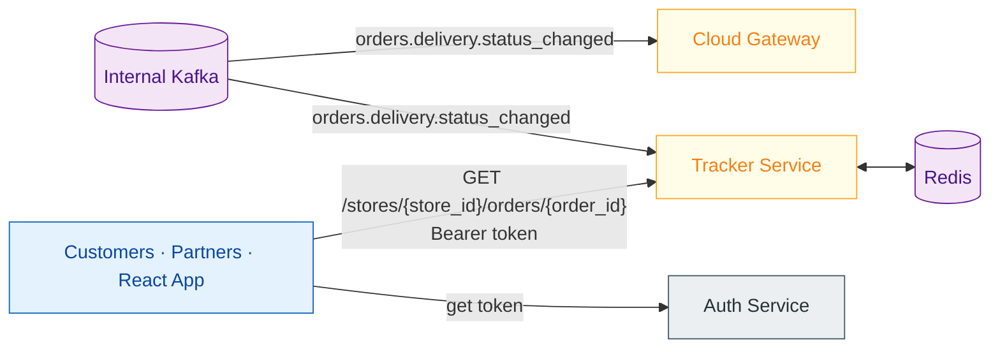

# Algo 4 - Tracker Service

**Owner team:** Algo 4 Platform
**Status:** Draft
**Last updated:** 2026-05-24

---

## 1. Purpose

The Tracker Service provides real-time order tracking for delivery orders. It consumes internal events, materializes a read-optimized view of order and carrier state, and exposes it as a public API to external customers, partner integrations, and the internal React Tracker app.

It is a **boundary service** — a peer of the Cloud Gateway, not downstream of it. Both subscribe to the internal Kafka EventBus independently. The Cloud Gateway handles DaaS / Proxy / Admin Panel; the Tracker Service handles the tracking API surface.

---

## 2. Architecture



---

## 3. Scope

### In Scope

- Consume `orders.delivery.status_changed` events to maintain current order state.
- Consume `courier.location.updated` events to maintain a rolling location buffer per order.
- Consume `delivery.provider.callback` events to update carrier status for 3PL orders.
- Expose REST API for querying order status and courier locations.
- Authenticate callers via JWT (issued by Auth Service).
- Store state in Redis (stateless service, horizontally scalable).
- Support multiple order identifier types (POS order ID, Algo order ID, external order ID).
- Support both numeric store numbers and alphanumeric store identifiers.

### Out of Scope (current phase)

- Event forwarding / webhook subscriptions (future phase — exists today in LocationService for Uber Marketplace integration).
- GraphQL surface (under consideration).
- WebSocket / SSE for real-time push (REST polling is sufficient given 10-30s location update interval).
- DragonTrack (old customer-facing tracker embedded in Proxy) — coexists for now.
- Per-user scope/market restrictions (TBD, under discussion).

---

## 4. Events Consumed

| Event | Topic | What Tracker does with it |
|---|---|---|
| **OrderDeliveryStatusChanged** | `orders.delivery.status_changed` | Updates order status, ETA, and timestamps |
| **CourierLocationUpdated** | `courier.location.updated` | Appends to fixed-size location buffer (last 100 points) |
| **DaasProviderCallback** | `delivery.provider.callback` | Updates carrier status for 3PL orders |

**Event source (open question):** Either direct Kafka subscription or HTTP from Cloud Gateway. See §9.

---

## 5. Data Model

### Order State

Stored as a JSON string in Redis, keyed by market and store:

```
tr-svc:market:{market}:store:{storeNo}:posorder:{id}
```

Lookup by non-POS identifiers is supported via mapping keys (`algoid:{id}` → POS ID, `externalid:{id}` → POS ID).

**Fields:** `storeNo`, `posOrderId / orderId / extOrderId`, `eta`, `status`, `carrierId`, `carrierStatus`, `source`, `aggProvider`, `createdAt`, `dispatchedAt`, `lastUpdatedAt`, `lastRefreshTimestamp`

**TTL:** 24 hours (production), 30 minutes (dev).

### Location Buffer

Stored as a Redis list, keyed per order:

```
tr-svc:market:{market}:store:{storeNo}:posorder:{posOrderId}:locations
```

Each entry: `{ lat, lng, timestamp }`

Capped at 100 entries (LTRIM on each append). TTL: 6 hours (production), 30 minutes (dev). Expiry is refreshed on each new location.

---

## 6. API Surface

Clients authenticate with Auth Service to obtain a JWT token, then call Tracker Service directly with the token as a Bearer header. The token must be valid; no additional credentials are needed per-request.

**Endpoints:**

| Method | Path | Description |
|---|---|---|
| `GET` | `/stores/{store_id}/orders/{order_id}` | Current order state (status, ETA, timestamps, carrier status) |
| `GET` | `/stores/{store_id}/orders/{order_id}/locations` | Carrier location trail for the order |

Both endpoints accept any known order identifier (POS, Algo, or external) in the `order_id` path segment, and both numeric and alphanumeric store identifiers in `store_id`.

The first endpoint supports an optional `?addlocations=true` query parameter to include the location trail inline.

Full API documentation with request/response shapes and error codes is maintained separately.

---

## 7. Operational Characteristics

**Scaling model:** The service is stateless — all state lives in Redis. Horizontal scaling is achieved by adding instances. Each instance is an independent Kafka consumer (same consumer group) and an independent HTTP server.

**Redis dependency:** The service relies on Redis being available. If Redis is down, queries return errors. There is no in-memory fallback in the new architecture.

**Event lag:** The service is eventually consistent. Under normal load, lag is negligible (Kafka throughput for our volume is not a concern). Alerting should trigger if consumer lag exceeds a configurable threshold, indicating something is wrong with the service rather than with Kafka itself.

**Availability:** Best-effort service. It is a window into the system — if temporarily unavailable, no business operations are affected. Orders continue to flow, couriers continue to deliver. The tracker view catches up once the service recovers.

---

## 8. Appendix: Status Values

### Order Statuses

| Status | Description |
|---|---|
| `New` | Order created (makeline) |
| `InOven` | Being prepared |
| `Packing` | Being packed |
| `ReadyForDelivery` | Packed, carrier assigned |
| `Enroute` | Carrier dispatched |
| `Delivered` | Delivered (final) |
| `CustomerNotHome` | Customer not home (final) |
| `CancelledOnDispatch` | Cancelled during dispatch (final) |
| `CancelledByRefund` | Cancelled with refund (final) |
| `CancelledOrder` | Cancelled (final) |

### Carrier Statuses

| Status | Description |
|---|---|
| `Unassigned` | No carrier assigned |
| `Accepted` | Carrier accepted delivery |
| `EnrouteToPickup` | On the way to store |
| `ArrivedAtStore` | At the store |
| `CarrierPickedUp` | Picked up from store |
| `EnrouteToDropoff` | On the way to customer |
| `Nearby` | Near drop-off location |
| `ArrivedToCustomer` | At customer's location |
| `DroppedOff` | Delivery completed |

---

## 9. Open Questions

| Question | Current Status |
|---|---|
| Event delivery: direct Kafka or HTTP from Cloud Gateway? | Both viable. Kafka = independent scaling, no Cloud Gateway load. HTTP = simpler deployment, no broker access needed. |
| Event forwarding / webhooks | Future phase. Batched POST of events to customer endpoints on a configurable interval (e.g. location updates every 30s to Uber Marketplace). |
| GraphQL surface | Under consideration alongside REST |
| Per-user scope / market restrictions | Under discussion. Currently any authenticated user can query any order. |
| Kitchen statuses in Tracker | Currently returned (`InOven`, `Packing`). Confirm if needed for external customers or only internal use. |
| DaaS order location source | 3PL couriers don't use DragonDrive. Location comes from provider callbacks. Confirm coverage. |
